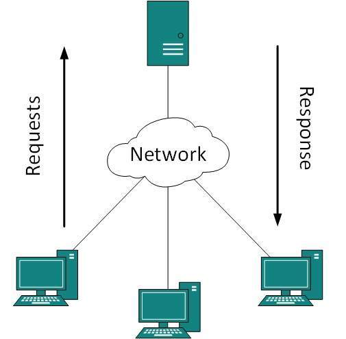
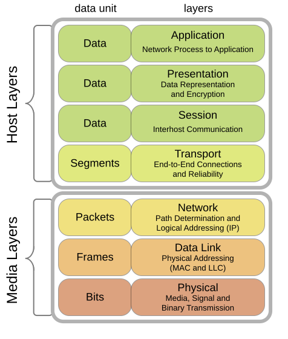
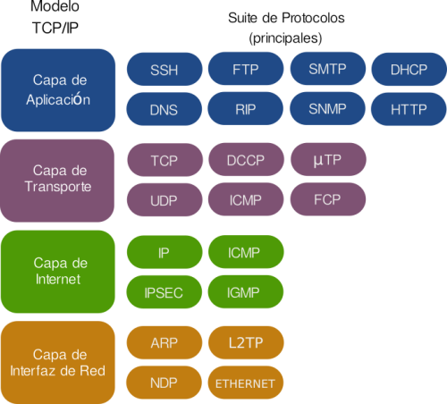
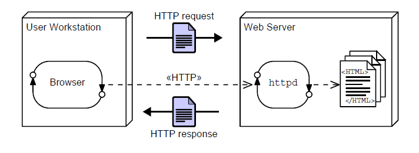
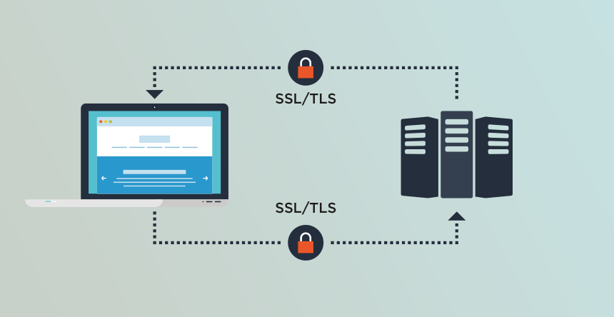
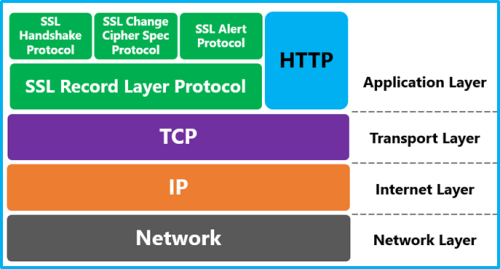
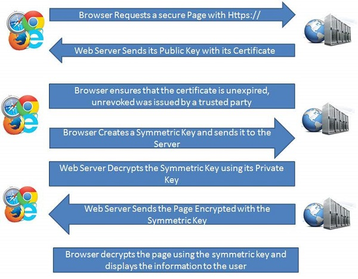
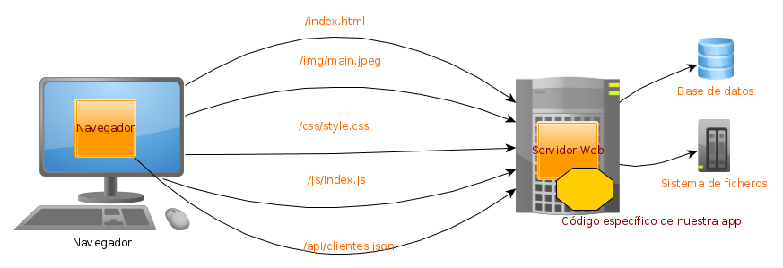

# UT1. INTRODUCCIÓN A LA WEB. PROTOCOLO HTTP.

## Arquitectura cliente-servidor

El modelo de desarrollo web se apoya, en una primera aproximación desde un punto de vista centrado en el hardware, en lo que se conoce como arquitectura cliente-servidor que define un patrón de arquitectura donde existen dos actores, cliente y servidor, de forma que el primero es quién se conecta con el segundo para solicitar algún servicio. 

En el caso que nos ocupa, el desarrollo web, los clientes solicitan que se les sirva una web para visualizarla, aunque también es posible solicitar información si hablamos del caso de los servicios web que también veremos más adelante. 

En ambos casos aparece el mismo escenario, donde un servidor se encuentra ejecutándose ininterrupidamente a la espera de que los diferentes clientes realicen una solicitud.

Normalmente a la solicitud que hacen los clientes al servidor se le llama petición **(REQUEST)** y a lo que el servidor devuelve a dicho cliente le llamamos respuesta **(RESPONSE)**.

También hay que tener en cuenta que esta arquitectura cliente-servidor plantea la posibilidad de numerosos clientes atendidos por un mismo servidor. Es decir, el servidor será un software multitarea que será capaz de atender peticiones simultáneas de numerosos clientes.



Desde un punto de vista de desarrollo una aproximación más detallada para este modelo de ejecución es lo que se conoce como modelo en 3 capas [1](https://en.wikipedia.org/wiki/Multitier_architecture). 

Es un modelo donde se muestra más en detalle como se distribuye el software que participa en cualquier desarrollo web. Sigue estando presente la arquitectura cliente-servidor (todo se basa en ella) pero aparecen más detalles como el software utilizado en cada uno de los dos actores y como interactúan las diferentes tecnologías o aplicaciones.

## Protocolos

La pila de protocolos en los que se basa Internet es muy amplia, ya sea siguiendo el modelo OSI o el modelo TCP. En cualquier caso, en el tema que nos ocupa a nosotros sólo nos fijaremos en la última capa, la capa de transporte. Es en esta capa donde están los protocolos de la web, los que usan navegadores y servidores (web y aplicaciones) para comunicarse. Al fin y al cabo, la web no es más que una de las tantas aplicaciones que existen en Internet. Otras aplicaciones, que también veremos en este curso, son FTP y SSH, entre otras.



Puesto que en esta asignatura nos centramos principalmente en la web y, aunque en menor medida, en los protocolos (de aplicación) que de alguna manera son de utilidad para trabajar con ella, nos centraremos exclusivamente en ellos:

- HTTP: HyperText Transfer Protocol. Protocolo de comunicación para la web
HTTPS: HTTP Secure. Protocolo seguro de comunicación para la web. Surge de aplicar una capa de seguridad, utilizando SSL/TLS, al protocolo HTTP

- Telnet: Es un protocolo que establece una línea de comunicación basada en texto entre un cliente y un servidor. Desde su aparición se utilizó ampliamente como vía de comunicación remota con el sistema operativo ya que permitía la ejecución remota de comandos. Con el tiempo ha ido cayendo en desuso a favor de un protocolo seguro que lo sustituye, SSH.

- SSH: Secure Shell. Protocolo seguro de comunicación ampliamente utilizado para la gestión remota de sistemas, ya que permite la ejecución remota de comandos. Surge como reemplazo para el protocolo no seguro Telnet.

- SCP: Secure Copy. Es una protocolo seguro (basado en RCP, Remote Copy) que permite transferir ficheros entre un equipo local y otro remoto o entre dos equipos remotos. Utiliza SSH por lo que garantiza la seguridad de la transferencia asi como de la autenticación de los usuarios.

- FTP: File Transfer Protocol. Es un protocolo que se utiliza para la transferencia de archivos entre un equipo local y otro remoto. Su principal problema es que tanto la autenticación como la transferencia se realiza como texto plano, por lo que se considera un protocolo no seguro.

- SFTP. SSH FTP. Es una versión del protocolo FTP que utiliza SSH para cifrar tanto la autenticación del usuario como la trasferencia de los archivos. Es la opción segura al uso de un protocolo como FTP



## Protocolo HTTP

El protocolo HTTP es un protocolo para la transferencia de páginas web (hipertexto) entre los clientes (navegadores web) y un servidor web. 

Cuando un usuario, a través del navegador, quiere un documento (página web), éste lo solicita mediante una petición HTTP al servidor. Éste le contestará con una respuesta HTTP y el documento, si dispone de él.

Hay que tener en cuenta que, al contrario que el resto de protocolos que estamos viendo en esta parte, **HTTP no tiene estado**. Eso significa que un servidor web **no almacena ninguna información sobre los clientes que se conectan a él**. Así, cada petición/respuesta supone una conexión única y aislada. 

En cualquier caso, **utilizando tecnologías en el lado servidor es posible escribir aplicaciones web que puedan establecer sesiones o cookies para almacenar ese estado y “recordar”** de alguna manera a los clientes en sucesivas conexiones



A continuación, a modo de ejemplo, podemos ver una petición HTTP que un navegador (Firefox) ha realizado a un sitio web (misitio.com), solicitando el documento index.html.

```
GET /index.html HTTP/1.1
 Host: www.misitio.com
 User-Agent: cliente
 Referer: www.google.com
 User-Agent: Mozilla/5.0 (X11; Linux x86_64; rv:45.0) Gecko/20100101 Firefox/45.0
 Connection: keep-alive
 [Línea en blanco]
```

Y el servidor web le contesta con el contenido del documento para que el navegador que lo ha solicitado lo pueda renderizar para que el usuario lo visualice en su pantalla:

```
HTTP/1.1 200 OK
Date: Fri, 31 Dec 2003 23:59:59 GMT
Content-Type: text/html
Content-Length: 1221
 
<html lang="es">
<head>
<meta charset="utf-8">
<title>Mi título</title>
</head>
<body>
<h1>Bienvenido a mi sitio.com</h1>
. . .
. . .
</body>
</html>
```

### Protocolo SSL/TLS

SSL (Secure Sockets Layer) y TSL (Transport Layer Security) son protocolos de cifrado que se utilizan para cifrar las comunicaciones en Internet. En ocasiones se hace referencia en ambos casos al uso de SSL pero la realidad es que TLS es el sucesor de SSL debido a las diferentes vulnerabilidades que han ido surgiendo de este último.

En este caso, la aplicación de esta capa de seguridad, cifrando las comunicaciones del protocolo HTTP, da lugar a lo que se conoce como HTTPS, que veremos a continuación.





### Protocolo HTTPS

El protocolo HTTPS (HTTP Secure) es un protocolo de comunicación segura a través de Internet. Este protocolo se basa en la comunicación del protocolo HTTP pero con una capa de seguridad adicional cifrando el contenido con TSL ó SSL.

Su principal utilidad es el cifrado de los mecanismos de autenticación en la web, justamente cuando el usuario envía sus credenciales al servidor para validar su sesión. Es el momento más crítico en una comunicación, aunque actualmente se está utilizando abiertamente durante toda la comunicación entre cliente y servidor en la web por privacidad e integridad.

Con respecto a la integridad, HTTPS proporciona un mecanismo de autenticación con respecto al sitio web y servidor web que estamos visitando, evitando asi ataques como el del Man in the Middle. Es la manera en la que podemos estar seguros de que el sitio con el que estamos comunicandonos es el que creemos que es.



### La web

La web son páginas (En formato HTML, Imagen, JSON, XML ,etc) que se interconectan entre ellas por enlaces (urls).

Su estructura es la siguiente:



- El navegador solicita por TCP/IP el recurso a obtener. El formato de como solicita ese recurso es por el protocolo HTTP. Y el servidor de TCP/IP responde usando el protocolo HTTP devolviendo los datos.

- En el ejemplo podemos ver que se pide el recurso /index.html. Una vez obtenido , el navegador ve que hay enlaces a otros recursos que también solicita al servidor:

- "/img/main.jpeg", "/css/style.css" y "/js/index.js": Los obtiene del sistema de archivos "/api/clientes.json": Lo obtiene en función de la información de la base de datos

Con todo ello , muestra la página HTML+CSS+Imagen y ejecuta el código JavaScript sobre la página dentro del navegador.

En el host servidor se estaba ejecutando el servidor TCP/IP que entiende el protocolo HTTP. A ese software lo llamaremos servidor Web. 

- El servidor es "personalizable" permitiendo que se ejecute código específico para nuestra aplicación. Ese código específico es el código de servidor que se suele escribir en Java, PHP, NodeJS, etc.

Por lo tanto en una app web hay 3 tipos de código:

- Código de visualización: HTML, CSS, Imágenes, Videos, etc.
- Código en el cliente: El JavaScript que se ejecuta en el navegador
- Código en el servidor: El programa específico de la aplicación que se ejecuta en el servidor Web

En la siguiente imagen vemos un esquema similar en el que las peticiones van hacia varios servidores Web


### Chrome DevTools

Los navegadores suelen llevar herramientas para depurar las páginas web. En Chrome , si pulsamos F12 y pinchamos en la opción de "Network" (Menu superior), podemos ver todas las peticiones que hace el navegador al cargar una página.


### El protocolo HTTP

#### Características

- Sencillo: Es en modo texto y sacil de usar directamente por una persona.

- Extensible: Se pueden enviar mas metadatos que los que estan por defecto. Ej: Nº de página

- Sin estado: Cada petición es independiente. Eso es un problema en sitios como por ejemplo un carrito de la compra.

#### Ventajas

- Cache: Mejora la velocidad al controlar la cache de las páginas
- Autenticación: Permite identificar a un usuario
- Proxys: Permite de forma transparente usar proxies
- Sesiones: Gracias a las cookies podemos mantener el estado entre peticiones.
- Formatos: Permite indicar el formato de lo que se envía, de lo que se pide y de lo que se retorna.

#### Formato

El formato lo vamos a explicar sobre un ejemplo.

Una petición HTTP tiene la siguiente forma:

```
GET /index.html HTTP/1.1
Host: www.miweb.com
Accept-Language: es
```

La respuesta del servidor es:

```
HTTP/1.1 200 OK
Content-Length: 29769
Content-Type: text/html; charset=utf-8

<!DOCTYPE html... (los 29769 bytes de la página)
```

Vamos ahora a explicar la petición

- GET: Es el método por el que se piden los datos. Entre sus valores está: GET, PUT,POST, DELETE.

- /index.html: Es la ruta dentro del servidor del documento que estamos pidiendo

- HTTP/1.1 : La versión del protocolo. Prácticamente siempre es 1.1

- Host: www.miweb.com: Cabecera llamada Host que indica el nombre del host al que va dirigida la petición.

- Accept-Language: es: Otra cabecera que indica en que idioma queremos que nos retorne los datos. En este caso es en francés.

Es decir que en una petición HTTP hay una primera línea y luego varias líneas con las cabeceras.

Pasemos ahora a explicar la respuesta:

- HTTP/1.1: La versión del protocolo con la que responde. Prácticamente siempre es 1.1

- 200 OK: Si ha sido existosa o no la petición.

- Content-Length: 29769: Cabecera llamada Content-Length que indica las bytes que ocupan los datos que se retornan

- Content-Type: text/html; charset=utf-8:Cabecera llamada Content-Type que indica el formato MIME type de los datos que retornan y su codificación. En este caso es en HTML y en formato UTF-8.
- `<!DOCTYPE html…: ` Son finalmente los datos que se han pedido.

#### Cabeceras HTTP

Existen muchas cabeceras HTTP, podemos ver un listado en [List of HTTP header fields](https://en.wikipedia.org/wiki/List_of_HTTP_header_fields). Pero aquí solo vamos a ver algunas.

Las cabeceras se dividen entre las que se envían en la petición y las que se retorna en la respuesta.

---
## Ejercicios

### Ejercicio 1
Navega a la página https://www.apache.org/ e indica:

Nº de peticiones que hace
Al menos dos Hosts a los que hace peticiones
Las rutas dentro del servidor de 4 recursos.
3 tipos distintos de ficheros que solicita (js o css o png , etc)
