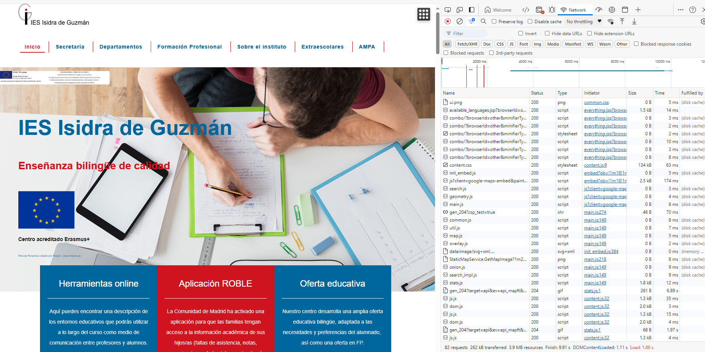

# UT1. INTRODUCCIÓN A LA WEB. PROTOCOLO HTTP.

## Arquitectura cliente-servidor

El modelo de desarrollo web se apoya, en una primera aproximación desde un punto de vista centrado en el hardware, en lo que se conoce como arquitectura cliente-servidor que define un patrón de arquitectura donde existen dos actores, cliente y servidor, de forma que el primero es quién se conecta con el segundo para solicitar algún servicio. 

En el caso que nos ocupa, el desarrollo web, los clientes solicitan que se les sirva una web para visualizarla, aunque también es posible solicitar información si hablamos del caso de los servicios web que también veremos más adelante. 

En ambos casos aparece el mismo escenario, donde un servidor se encuentra ejecutándose ininterrupidamente a la espera de que los diferentes clientes realicen una solicitud.

Normalmente a la solicitud que hacen los clientes al servidor se le llama petición **(REQUEST)** y a lo que el servidor devuelve a dicho cliente le llamamos respuesta **(RESPONSE)**.

También hay que tener en cuenta que esta arquitectura cliente-servidor plantea la posibilidad de numerosos clientes atendidos por un mismo servidor. Es decir, el servidor será un software multitarea que será capaz de atender peticiones simultáneas de numerosos clientes.


Desde un punto de vista de desarrollo una aproximación más detallada para este modelo de ejecución es lo que se conoce como modelo en 3 capas [1](https://en.wikipedia.org/wiki/Multitier_architecture). 

Es un modelo donde se muestra más en detalle como se distribuye el software que participa en cualquier desarrollo web. Sigue estando presente la arquitectura cliente-servidor (todo se basa en ella) pero aparecen más detalles como el software utilizado en cada uno de los dos actores y como interactúan las diferentes tecnologías o aplicaciones.

## Protocolos

La pila de protocolos en los que se basa Internet es muy amplia, ya sea siguiendo el modelo OSI o el modelo TCP. En cualquier caso, en el tema que nos ocupa a nosotros sólo nos fijaremos en la última capa, la capa de transporte. Es en esta capa donde están los protocolos de la web, los que usan navegadores y servidores (web y aplicaciones) para comunicarse. Al fin y al cabo, la web no es más que una de las tantas aplicaciones que existen en Internet. Otras aplicaciones, que también veremos en este curso, son FTP y SSH, entre otras.


Puesto que en esta asignatura nos centramos principalmente en la web y, aunque en menor medida, en los protocolos (de aplicación) que de alguna manera son de utilidad para trabajar con ella, nos centraremos exclusivamente en ellos:

- HTTP: HyperText Transfer Protocol. Protocolo de comunicación para la web
HTTPS: HTTP Secure. Protocolo seguro de comunicación para la web. Surge de aplicar una capa de seguridad, utilizando SSL/TLS, al protocolo HTTP

- Telnet: Es un protocolo que establece una línea de comunicación basada en texto entre un cliente y un servidor. Desde su aparición se utilizó ampliamente como vía de comunicación remota con el sistema operativo ya que permitía la ejecución remota de comandos. Con el tiempo ha ido cayendo en desuso a favor de un protocolo seguro que lo sustituye, SSH.

- SSH: Secure Shell. Protocolo seguro de comunicación ampliamente utilizado para la gestión remota de sistemas, ya que permite la ejecución remota de comandos. Surge como reemplazo para el protocolo no seguro Telnet.

- SCP: Secure Copy. Es una protocolo seguro (basado en RCP, Remote Copy) que permite transferir ficheros entre un equipo local y otro remoto o entre dos equipos remotos. Utiliza SSH por lo que garantiza la seguridad de la transferencia asi como de la autenticación de los usuarios.

- FTP: File Transfer Protocol. Es un protocolo que se utiliza para la transferencia de archivos entre un equipo local y otro remoto. Su principal problema es que tanto la autenticación como la transferencia se realiza como texto plano, por lo que se considera un protocolo no seguro.

- SFTP. SSH FTP. Es una versión del protocolo FTP que utiliza SSH para cifrar tanto la autenticación del usuario como la trasferencia de los archivos. Es la opción segura al uso de un protocolo como FTP


## Protocolo HTTP

El protocolo HTTP es un protocolo para la transferencia de páginas web (hipertexto) entre los clientes (navegadores web) y un servidor web. 

Cuando un usuario, a través del navegador, quiere un documento (página web), éste lo solicita mediante una petición HTTP al servidor. Éste le contestará con una respuesta HTTP y el documento, si dispone de él.

Hay que tener en cuenta que, al contrario que el resto de protocolos que estamos viendo en esta parte, **HTTP no tiene estado**. Eso significa que un servidor web **no almacena ninguna información sobre los clientes que se conectan a él**. Así, cada petición/respuesta supone una conexión única y aislada. 

En cualquier caso, **utilizando tecnologías en el lado servidor es posible escribir aplicaciones web que puedan establecer sesiones o cookies para almacenar ese estado y “recordar”** de alguna manera a los clientes en sucesivas conexiones


A continuación, a modo de ejemplo, podemos ver una petición HTTP que un navegador (Firefox) ha realizado a un sitio web (misitio.com), solicitando el documento index.html.

```
GET /index.html HTTP/1.1
 Host: www.misitio.com
 User-Agent: cliente
 Referer: www.google.com
 User-Agent: Mozilla/5.0 (X11; Linux x86_64; rv:45.0) Gecko/20100101 Firefox/45.0
 Connection: keep-alive
 [Línea en blanco]
```

Y el servidor web le contesta con el contenido del documento para que el navegador que lo ha solicitado lo pueda renderizar para que el usuario lo visualice en su pantalla:

```
HTTP/1.1 200 OK
Date: Fri, 31 Dec 2003 23:59:59 GMT
Content-Type: text/html
Content-Length: 1221
 
<html lang="es">
<head>
<meta charset="utf-8">
<title>Mi título</title>
</head>
<body>
<h1>Bienvenido a mi sitio.com</h1>
. . .
. . .
</body>
</html>
```

### Protocolo SSL/TLS

SSL (Secure Sockets Layer) y TSL (Transport Layer Security) son protocolos de cifrado que se utilizan para cifrar las comunicaciones en Internet. En ocasiones se hace referencia en ambos casos al uso de SSL pero la realidad es que TLS es el sucesor de SSL debido a las diferentes vulnerabilidades que han ido surgiendo de este último.

En este caso, la aplicación de esta capa de seguridad, cifrando las comunicaciones del protocolo HTTP, da lugar a lo que se conoce como HTTPS, que veremos a continuación.


### Protocolo HTTPS

El protocolo HTTPS (HTTP Secure) es un protocolo de comunicación segura a través de Internet. Este protocolo se basa en la comunicación del protocolo HTTP pero con una capa de seguridad adicional cifrando el contenido con TSL ó SSL.

Su principal utilidad es el cifrado de los mecanismos de autenticación en la web, justamente cuando el usuario envía sus credenciales al servidor para validar su sesión. Es el momento más crítico en una comunicación, aunque actualmente se está utilizando abiertamente durante toda la comunicación entre cliente y servidor en la web por privacidad e integridad.

Con respecto a la integridad, HTTPS proporciona un mecanismo de autenticación con respecto al sitio web y servidor web que estamos visitando, evitando asi ataques como el del Man in the Middle. Es la manera en la que podemos estar seguros de que el sitio con el que estamos comunicandonos es el que creemos que es.


### La web

La web son páginas (En formato HTML, Imagen, JSON, XML ,etc) que se interconectan entre ellas por enlaces (urls).

Su estructura es la siguiente:


- El navegador solicita por TCP/IP el recurso a obtener. El formato de como solicita ese recurso es por el protocolo HTTP. Y el servidor de TCP/IP responde usando el protocolo HTTP devolviendo los datos.

- En el ejemplo podemos ver que se pide el recurso /index.html. Una vez obtenido , el navegador ve que hay enlaces a otros recursos que también solicita al servidor:

- "/img/main.jpeg", "/css/style.css" y "/js/index.js": Los obtiene del sistema de archivos "/api/clientes.json": Lo obtiene en función de la información de la base de datos

Con todo ello , muestra la página HTML+CSS+Imagen y ejecuta el código JavaScript sobre la página dentro del navegador.

En el host servidor se estaba ejecutando el servidor [TCP/IP](https://learn.microsoft.com/es-es/dotnet/fundamentals/networking/sockets/socket-services) que entiende el protocolo HTTP. A ese software lo llamaremos servidor Web. 

- El servidor es "personalizable" permitiendo que se ejecute código específico para nuestra aplicación. Ese código específico es el código de servidor que se suele escribir en Java, PHP, NodeJS, etc.

Por lo tanto en una app web hay 3 tipos de código:

- Código de visualización: HTML, CSS, Imágenes, Videos, etc.
- Código en el cliente: El JavaScript que se ejecuta en el navegador
- Código en el servidor: El programa específico de la aplicación que se ejecuta en el servidor Web

- [Estadísticas de Servidores Web](https://w3techs.com/)

En la siguiente imagen vemos un esquema similar en el que las peticiones van hacia varios servidores Web


### Chrome DevTools

Los navegadores suelen llevar herramientas para depurar las páginas web. En Chrome , si pulsamos F12 y pinchamos en la opción de "Network" (Menu superior), podemos ver todas las peticiones que hace el navegador al cargar una página.




## El protocolo HTTP

### Características

- Sencillo: Es en modo texto y fácil de usar directamente por una persona.

- Extensible: Se pueden enviar mas metadatos que los que estan por defecto. Ej: Nº de página

- Sin estado: Cada petición es independiente. Eso es un problema en sitios como por ejemplo un carrito de la compra.

### Ventajas

- Cache: Mejora la velocidad al controlar la cache de las páginas
- Autenticación: Permite identificar a un usuario
- Proxys: Permite de forma transparente usar proxies
- Sesiones: Gracias a las cookies podemos mantener el estado entre peticiones.
- Formatos: Permite indicar el formato de lo que se envía, de lo que se pide y de lo que se retorna.

* [Versiones HTTP](https://developer.mozilla.org/es/docs/Web/HTTP/Basics_of_HTTP/Evolution_of_HTTP)
* [HTTP/3](https://www.cloudflare.com/es-es/learning/performance/what-is-http3/)
* [Verificador de Versión](https://http3check.net/)
* [Proxy Inverso](https://www.cloudflare.com/es-es/learning/cdn/glossary/reverse-proxy/)

### Formato

El formato lo vamos a explicar sobre un ejemplo.

Una petición HTTP tiene la siguiente forma:

```
GET /index.html HTTP/1.1
Host: www.miweb.com
Accept-Language: es
```

La respuesta del servidor es:

```
HTTP/1.1 200 OK
Content-Length: 29769
Content-Type: text/html; charset=utf-8

<!DOCTYPE html... (los 29769 bytes de la página)
```

Vamos ahora a explicar la **petición** o **REQUEST**

- **GET**: Es el método por el que se piden los datos. Entre sus valores está: GET, PUT,POST, DELETE.

- **/index.html**: Es la ruta dentro del servidor del documento que estamos pidiendo

- **HTTP/1.1** : La versión del protocolo. Prácticamente siempre es 1.1

- **Host**: www.miweb.com: Cabecera llamada **Host** que indica el nombre del host al que va dirigida la petición.

- **Accept-Language**: es: Otra cabecera que indica en que idioma queremos que nos retorne los datos. En este caso es en francés.

Es decir que en una petición HTTP hay una primera línea y luego varias líneas con las cabeceras.

Pasemos ahora a explicar la **respuesta** o **RESPONSE**:

- **HTTP/1.1**: La versión del protocolo con la que responde. Prácticamente siempre es 1.1

- **200 OK**: Si ha sido existosa o no la petición.

- **Content-Length: 29769:** Cabecera llamada Content-Length que indica las bytes que ocupan los datos que se retornan

- **Content-Type: text/html; charset=utf-8:** Cabecera llamada Content-Type que indica el formato MIME type de los datos que retornan y su codificación. En este caso es en HTML y en formato UTF-8.

- `<!DOCTYPE html…: ` Son finalmente los datos que se han pedido.

### Cabeceras HTTP

Existen muchas cabeceras HTTP, podemos ver un listado en [List of HTTP header fields](https://en.wikipedia.org/wiki/List_of_HTTP_header_fields). Pero aquí solo vamos a ver algunas.

Las cabeceras se dividen entre las que se envían en la petición y las que se retorna en la respuesta.

#### Petición

Cabeceras que se pueden enviar en la petición

- Accept: El formato [MIME type](https://en.wikipedia.org/wiki/Media_type) en la que queremos que se retornen los datos. Ej: En text/html, en text/xml, application/json , application/pdf, etc. Luego el servidor los retornará en el formato que quiera/pueda

- Accept-Language: El idioma en el que queremos que nos retorne los datos.. Luego el servidor los retornará en el idioma que quiera/pueda.
Host: El dominio al que se está enviando la petición. Esta cabecera el muy útil ya que permite en un mismo servidor tener alojados varios dominios.

- Content-Type: El formato de los datos que envian al servidor. Ej: En text/html, en text/xml, application/json , application/pdf, etc. Y como están codificado. Normalmente los formatos son utf-8 o ISO-8859-1.

#### Respuesta
Cabeceras que se pueden enviar en la respuesta

- Content-Type: El formato de los datos que se retorna. Ej: En text/html, en text/xml, application/json , application/pdf, etc. Y como están codificado. Normalmente los formatos son utf-8 o ISO-8859-1. No tiene porque coincidir con Accept.

- Content-Language: El idioma de los datos que se retorna.

- Content-Length: Tamaño en bytes de los datos

- Cache-Control: Cuanto tiempo pueden estar cacheado los datos.

> La cabecera Content-Type es imporante para el programador ya que el servidor puede no saber exactamente el formato de los datos y es necesario que lo indiquemos nosotros.Muchas veces hay ademas problemas con la codificación si es utf-8 o ISO-8859-1 por lo que también se debe indicar.

> Por otro lado notar que Content-Type se puede usar tanto en la petición como en la respuesta. Se usa en la petición si se envían datos en la petición

#### Estados HTTP

[Códigos de Estado HTTP](https://es.wikipedia.org/wiki/Anexo:C%C3%B3digos_de_estado_HTTP)

Es estado es lo que indica si una petición HTTP ha tenido éxito o no. Sus principales valores son:

- 200-299: La petición ha tenido éxito
- 300-399: Redirección de los datos.
- 400-499: Los datos que ha enviado el cliente no son correctos
- 500-599: Se ha producido un error en el servidor.

Mas información en Códigos de estado HTTP

De entre todos los código están algunos que solemos ver a menudo:

- 204: La petición no retorna datos.
- 403: Prohibido el acceso al documento
- 404: No encuentra el documento
- 500: Error del servidor

#### Métodos

Los métodos ( o verbos) HTTP indican que acción queremos hacer con los datos. Al navegar normalmente se usa siempre el GET.

- GET: Queremos obtener los datos
- POST: Queremos añadir los datos.
- PUT: Queremos actualizar nuevos datos.
- DELETE: Queremos borrar los datos.

Así por ejemplo si enviamos;

```
GET /index.html HTTP/1.1
Host: www.fpmislata.com
Accept-Language: fr
```

Obtendremos el fichero index.html pero si enviamos:

``` 
DELETE /index.html HTTP/1.1
Host: www.fpmislata.com
Accept-Language: fr
```

### REST ( REpresentational State Transfer))


- Podríamos decir que REST es usar toda la potencia de HTTP en nuestras propias aplicaciones. 

- Suele usar de forma general el formato usado en los datos es JSON , es muy sencilla y utiliza todas las características que puede de HTTP en vez de reinventarse lo que ya tiene HTTP. 

- Esta última característica yo creo que es la que mejor explica que es REST: Si algo ya existe en HTTP y REST siempre funciona bajo HTTP, ¿porque no usar entonces todo lo que ofrece HTTP?. 

- Por lo tanto cuando necesitemos algo en nuestra aplicación siempre debemos preguntarnos , ¿como resuelve este problema ya el protocolo HTTP? Y usarlo en vez de crear nuestra solución.

#### Las operaciones a realizar

Vamos a ver 4 métodos HTTP que coinciden con los 4 métodos de un CRUD o con operaciones de SQL


- Donde pone {idLibro} se subtituiría por el id del libro.

- El "JSON Enviado" es el JSON que se debe enviar con los datos al hacer esa petición. Como podemos ver solo se envía al insertar o al actualizar. Es decir es el JSON del usuario a insertar o el JSON con los nuevo datos del usuario a modificar.

- El "JSON Retornado" es lo que nos retornará el servidor. Como vemos nos retorna un JSON con los datos en todos los casos excepto en el borrado, y no lo hace ya que no existe ningún dato a retornar ya que lo hemos borrado.

#### La Estructura de la URL

Veamos la estructura de la URL de las peticiones en un supuesto ejemplo de una base de datos de usuarios.


--- 
# Live


1. GET Request
Una petición GET es la más común y sirve para solicitar datos de un servidor. En este caso, solicitamos información de un recurso:

```
curl -X GET https://jsonplaceholder.typicode.com/posts/1
```

Explicación:

-X GET: especifica el tipo de solicitud (GET es el predeterminado, pero lo incluimos explícitamente).
La URL es la dirección del recurso.

2. POST Request
Una petición POST se utiliza para enviar datos al servidor, como crear un nuevo recurso. Para simular esta solicitud, enviamos un objeto JSON:

```
curl -X POST https://jsonplaceholder.typicode.com/posts \
     -H "Content-Type: application/json" \
     -d '{"title": "foo", "body": "bar", "userId": 1}'
```

Explicación:

-X POST: Especifica el método POST.
-H "Content-Type: application/json": Especifica el tipo de contenido, en este caso JSON.
-d '{"title": "foo", "body": "bar", "userId": 1}': Los datos que enviamos como JSON.

3. PUT Request

La petición PUT se usa para actualizar un recurso existente. En este ejemplo, actualizamos el post con id=1:

```
curl -X PUT https://jsonplaceholder.typicode.com/posts/1 \
     -H "Content-Type: application/json" \
     -d '{"id": 1, "title": "updated title", "body": "updated body", "userId": 1}'
```


Explicación:

-X PUT: Especifica el método PUT.
El resto es similar a la solicitud POST, pero el recurso ya existe, y por lo tanto, es actualizado.

4. PATCH Request

La petición PATCH es para realizar una actualización parcial de un recurso. A continuación se muestra cómo se cambia solo un campo del recurso:

```
curl -X PATCH https://jsonplaceholder.typicode.com/posts/1 \
     -H "Content-Type: application/json" \
     -d '{"title": "new title"}'
```

Explicación: Solo estamos actualizando el campo title.

5. DELETE Request

La petición DELETE se utiliza para eliminar un recurso. Aquí eliminamos el post con id=1:

```
curl -X DELETE https://jsonplaceholder.typicode.com/posts/1
Explicación:
-X DELETE: Especifica que estamos eliminando el recurso indicado por la URL.
```

6. Enviando Parámetros en una Solicitud GET
Puedes enviar parámetros en la URL al realizar una solicitud GET. Aquí se muestra cómo hacerlo:

```
curl -X GET "https://jsonplaceholder.typicode.com/posts?userId=1"
```

Explicación: Enviamos el parámetro userId=1 en la URL.

7. Autenticación Básica

Algunos recursos requieren autenticación básica. Aquí te muestro cómo enviar las credenciales usuario y contraseña:

```
curl -u usuario:contraseña https://ejemplo.com/protegido
```

Explicación:
-u usuario:contraseña: Envia las credenciales para la autenticación.

8. Enviando Headers Personalizados

Si necesitas enviar headers adicionales en la solicitud, puedes hacerlo con la opción -H:

```
curl -X GET https://jsonplaceholder.typicode.com/posts/1 \
     -H "Authorization: Bearer <token>"
```


Explicación:

-H "Authorization: Bearer <token>": Envia un token de autenticación en el header.

9. Guardando la Respuesta en un Archivo

Puedes redirigir la salida de la respuesta a un archivo:

```
curl -X GET https://jsonplaceholder.typicode.com/posts/1 -o respuesta.json
```

Explicación:

-o respuesta.json: Guarda la respuesta en un archivo llamado respuesta.json.

10. Ver los Headers de Respuesta

Si quieres ver los headers de la respuesta, utiliza la opción -I:

```
curl -I https://jsonplaceholder.typicode.com/posts/1
```


Explicación:

-I: Muestra solo los headers de la respuesta, sin el cuerpo.

---
## Ejercicios


#### Ejercicio 1

 Usando curl con la API de prueba de jsonplaceholder.typicode.com. Los ejemplos incluyen las rutas y los recursos adecuados para realizar operaciones CREATE, READ, UPDATE y DELETE en diferentes recursos (como posts, comments, users, etc.). ** Averigua los códigos HTTP de respuesta **

1. Create (POST): Crear un nuevo post
2. Read (GET): Obtener todos los posts
3. Read (GET): Obtener un post específico
4. Update (PUT): Actualizar un post existente
5. Update (PATCH): Actualizar parcialmente un post
6. Delete (DELETE): Eliminar un post
7. Create (POST): Crear un nuevo comentario
8. Read (GET): Obtener todos los comentarios de un post
9. Delete (DELETE): Eliminar un comentario

* Usar -i para incluir las cabeceras HTTP en la respuesta
* Usar -v para ver la solicitud y la respuesta en detalle
* Usar -w "%{http_code}" para mostrar solo el código HTTP


---

## ¿Qué es un VPS?

Un servidor es una computadora en la que tu proveedor de alojamiento web almacena los archivos y las bases de datos necesarios para tu sitio web. Cada vez que un visitante en línea quiere acceder a tu sitio web, su navegador le envía una solicitud a tu servidor y transfiere los archivos necesarios a través de Internet. El alojamiento VPS te proporciona un servidor en la nube que simula un servidor físico; sin embargo, en realidad, la máquina se comparte entre varios usuarios.

Al usar la tecnología de virtualización, tu proveedor de alojamiento web instala una capa virtual sobre el sistema operativo del servidor. Esta capa divide el servidor en particiones y le permite a cada usuario instalar su propio sistema operativo y software.

Por lo tanto, un servidor privado virtual (VPS) es tanto virtual como privado porque tienes control absoluto. Está separado de otros usuarios del servidor a nivel del sistema operativo. De hecho, la tecnología VPS es similar a la creación de particiones en tu computadora cuando quieres ejecutar más de un sistema operativo (por ejemplo, Windows y Linux) sin tener que reiniciar.

[](img/vps.gif)

Un VPS te permite configurar tu sitio web dentro de un contenedor seguro con recursos garantizados (memoria, espacio en disco, núcleos de CPU, etc.) que no tienes que compartir con otros usuarios. Con el hosting VPS, tienes el mismo acceso de nivel raíz que si alquilaras un servidor dedicado, pero a un costo mucho más bajo.

El VPS es una solución más segura y estable que el hosting compartido, con el que no obtienes espacio de servidor dedicado. Sin embargo, es de menor escala y más barato que alquilar un servidor completo.

El hosting VPS generalmente es elegido por los propietarios de sitios web que tienen un tráfico de nivel medio que excede los límites de los planes de hosting compartido pero que aún no necesitan los recursos de un servidor dedicado.

**CONEXIÓN MEDIANTE SSH**

Aunque nuestra máquina virtual esté en nuestro ordenador, ya hemos dicho que estamos simulando un VPS remoto. Para conectarnos a una máquina de forma remota y segura, la opción más recomendable es SSH.

[](img/ssh.webp)

SSH o Secure Shell es un protocolo de red criptográfico para operar servicios de red de forma segura a través de una red no protegida. Las aplicaciones típicas incluyen línea de comandos remota, inicio de sesión y ejecución de comandos remota, pero cualquier servicio de red puede protegerse con SSH.

SSH proporciona un canal seguro a través de una red no segura mediante el uso de una arquitectura cliente-servidor , conectando una aplicación cliente SSH con un servidor SSH. El puerto TCP estándar para SSH es 22 y se usa generalmente para acceder a sistemas operativos similares a Unix, pero también se puede usar en Microsoft Windows.

Proporciona un mecanismo para autenticar un usuario remoto, transferir entradas desde el cliente al host y retransmitir la salida de vuelta al cliente.

SSH tiene muchas aplicaciones diferentes:

- Gestión de servidores a los que no se puede acceder localmente
- Transferencia segura de archivos
- Creación de copias de seguridad
- Conexión entre dos ordenadores con encriptación de extremo a extremo
- Mantenimiento remoto desde otros ordenadores

**AUTENTICACIÓN**

Los dos métodos de autenticación de usuario SSH más comunes que se utilizan son las contraseñas (**cifrado simétrico**) y las claves SSH (**cifrado asimétrico o de clave pública**). 

Los clientes envían contraseñas cifradas al servidor de forma segura. Sin embargo, las contraseñas son un método de autenticación arriesgado porque su solidez depende de que el usuario sepa qué hace que una contraseña sea segura.

Los pares de claves pública-privada SSH encriptados asimétricamente son una mejor opción. Una vez que el cliente descifra el mensaje, el servidor le otorga acceso al sistema.

Es decir, SSH opta por el cifrado híbrido, donde se utiliza el cifrado asimétrico para intercambiar unas claves que serán las que se utilizarán posteriormente en el intercambio de información.

Este tipo de cifrado utiliza la misma clave para cifrar y para descifrar la información. Por este motivo, la clave debe ser secreta y sólo conocida por el emisor y el receptor del mensaje.

**1. Cifrados simétricos o de clave privada**

Este tipo de cifrado utiliza la misma clave para cifrar y para descifrar la información. Por este motivo, la clave debe ser secreta y sólo conocida por el emisor y el receptor del mensaje.

[](img/simetrico.png)

**Ventajas**

- Muy rápidos → cifrar y descifrar un mensaje cada vez requiere un cierto tiempo, que si el algoritmo es complejo, puede ser elevado.

**Inconvenientes**

Si alguien no autorizado consigue la clave, podrá espiar la comunicación sin problemas

¿Cómo hacemos para que emisor y receptar conozcan la clave en un primer momento? → no se puede transmitir por el canal inseguro → hay que transmitirla por otro canal seguro Ejemplos: PIN de la tarjeta del banco o archivo comprimido con contraseña.

**2.Cifrados asimétricos o de clave pública**

En este tipo de cifrados cada usuario utiliza un par de claves: una clave pública y una clave privada. Un mensaje cifrado con la clave pública sólo se puede descifrar con su correspondiente clave privada y viceversa. 

[](img/asimetrico.png)

La *clave pública* es accesible a cualquier persona que quiera consultarla, no hace falta que sea transmitida por un canal seguro como en el caso anterior.

La *clave privada* sólo la debe conocer su dueño.

**Funcionamiento:**

1. El emisor cifra un mensaje con la clave pública del receptor
2. El receptor recibe el mensaje y es el único que podrá descifrarlo porque es el único que posee la clave cifrada asociada

> En el cifrado asimétrico un equipo A que cifra un mensaje con la clave pública de B, envía el mensaje a B cifrado, sin enviar claves de por medio ni nada. Y luego B con su clave privada decodifica el mensaje de A.

**Ventajas**

- No se necesita un nuevo canal independiente y seguro para transmitir la clave

**Inconvenientes**

- Son más lentos que los cifrados simétricos

- Hay que proteger muy bien la clave privada y tenerla siempre disponible para poder descifrar los mensajes (no es una contraseña)

- Hay que asegurarse de que la clave pública es de quién dice ser y no de un impostor que se esté haciendo pasar por él

> Herramientas SSH y WINSCP