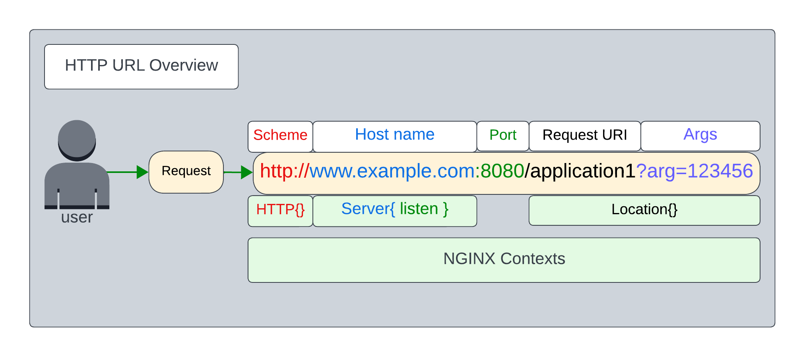
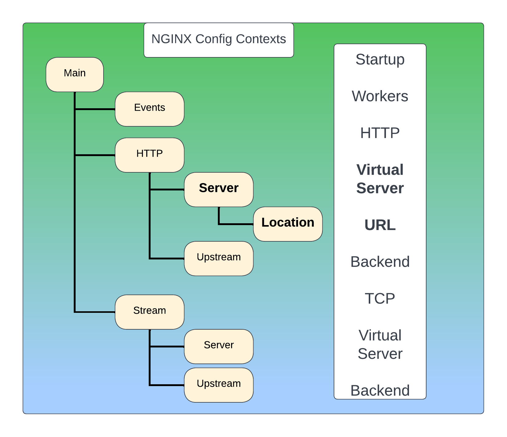

# UNIDAD 2: SERVIDORES WEB

## Tabla de Contenidos

1. [Introducción](#introducción)
2. [NGINX Configuración General](#nginx-configuración-general)
3. [Usando NGINX con varios Servername en el 80](#Usando-NGINX-con-varios-Servername-en-el-80)
4. [Directivas NGINX](directivas-nginx)


# Introducción

Con la evolución y el acceso libre a Internet, uno de los principales alicientes que han surgido es la publicación de páginas web donde se pueden almacenar unos contenidos bastante atractivos para nosotros y que, al mismo tiempo, pueden ser consultados desde cualquier del mundo para todos.

Cabe decir que, con la popularización de Internet, tanto empresas como usuarios han visto la necesidad de establecer un punto desde donde anunciar sus productos, o bien, a título particular, dar publicidad a las aficiones o capacidades personales mediante la publicación de páginas web.

Las páginas web, en su mayoría en formato HTML, requieren ser alojadas en máquinas que dispongan de espacio en disco para almacenar archivos HTML, imágenes, bloques de código o archivos de vídeo en directorios específicos y, al mismo tiempo, deben ser capaces de entender todo tipo de extensión de los archivos que son enviados en ambos sentidos de la comunicación.


Paralelamente, no podemos dejar de lado la importancia de las medidas de seguridad ante los peligros existentes en Internet. Para ello, las páginas deberán estar diseñadas considerando la incorporación de protocolos de comunicación seguros como, por ejemplo, los desarrollados con el protocolo seguro de transferencia de hipertexto (HTTPS, Hyper Text Transfer Protocol secure) que utilizan claves y estrategias de cifrado propias de las herramientas del protocolo de capa de conexión segura (SSL, secure sockets layer).

Las máquinas que alojan las páginas web reciben la categoría de servidores web. Desde el punto de vista de los servidores, los requerimientos más relevantes son el espacio de disco necesario para poder almacenar la estructura de la página web y una buena conexión de red para que el consumo de la unidad de procesamiento central (CPU, central processing unit ) sea bastante bajo.

El funcionamiento de los servidores web es especial ya que, como si se tratara de un diente de sierra, tienen consumos de recursos puntuales porque podemos estar un tiempo sin peticiones y, de repente, tener una avalancha de peticiones. Esto hace que los servidores web suelan tener un número bajo de procesos en espera. A medida que resultan necesarios, se van arrancando nuevos.

Cabe decir que no todas las peticiones consumen el mismo, y, por ejemplo, aquellas páginas web que ejecuten programas de interacción con el usuario o requieran cifrado (HTTPS) consumen más recursos que otras páginas web con menos interacción.

**¿Qué es un servidor web?**

Los servidores web sirven para almacenar contenidos de Internet y facilitar su disponibilidad de forma constante y segura. Cuando visitas una página web desde tu navegador, es en realidad un servidor web el que envía los componentes individuales de dicha página directamente a tu ordenador. Esto quiere decir que para que una página web sea accesible en cualquier momento, el servidor web debe estar permanentemente online.

Toda página accesible en Internet necesita un servidor especial para sus contenidos web. A menudo, las grandes empresas y organizaciones cuentan con un servidor web propio para disponer sus contenidos en Intranet e Internet. Sin embargo, la mayoría de administradores recurren a los centros de datos de proveedores de alojamiento web para sus proyectos. Independientemente de si tienes un servidor web propio o de si alquilas uno externo, siempre necesitarás un software para gestionar los datos de tu página y mantenerla actualizada. En este sentido, tienes la posibilidad de elegir entre varias soluciones de software para servidores web diseñadas para diferentes aplicaciones y sistemas operativos.

**Tecnología de servidores web**

Principalmente, el software de un servidor HTTP es el encargado de proporcionar los datos para la visualización del contenido web.

Para abrir una página web, el usuario solo tiene que escribir el URL correspondiente en la barra de direcciones de su navegador web. El navegador envía una solicitud al servidor web, quien responde, por ejemplo, entregando una página HTML. Esta puede estar alojada como un documento estático en el host o ser generada de forma dinámica, lo que significa que el servidor web tiene que ejecutar un código de programa (p. ej., Java o PHP) antes de tramitar su respuesta.

El navegador interpreta la respuesta, lo que suele generar automáticamente más solicitudes al servidor a propósito de, por ejemplo, imágenes integradas o archivos CSS (hojas de estilos).


El protocolo utilizado para la transmisión es HTTP (o su variante cifrada HTTPS), que se basa, a su vez, en los protocolos de red IP y TCP (y muy rara vez en UDP). 

***Un servidor web puede entregar los contenidos simultáneamente a varios ordenadores o navegadores web. La cantidad de solicitudes (requests) y la velocidad con la que pueden ser procesadas depende, entre otras cosas, del hardware y la carga (número de solicitudes) del host.***

Sin embargo, la complejidad del contenido también juega un papel importante: 

***los contenidos web dinámicos necesitan más recursos que los contenidos estáticos.***


La selección del equipo adecuado para el servidor y la decisión de si este debe ser dedicado, virtual o en la nube, se debe hacer pensando siempre en evitar sobrecargas en el servidor. 

Aunque se haya encontrado un servidor web que se adapta perfectamente a las necesidades del proyecto, siempre se corre el riesgo de que se presenten fallos en él como consecuencia de imprecisiones técnicas o cortes de energía en el centro de datos del host. 

Aunque no es muy frecuente, durante un período de inactividad de este tipo (downtime), la web no estará disponible.

**Otras funciones de los servidores web**

Aunque su principal función es la transferencia de contenido web, muchos programas de servidor web ofrecen características adicionales:

| **Seguridad**  |  **Cifrado de la comunicación entre el servidor web y el cliente vía HTTPS** |
|---|---|
|  Autenticación del usuario |  Autenticación HTTP para áreas específicas de una aplicación web |
|  Redirección |  Redirección de una solicitud de documento por medio de Rewrite Engine |
 | Redirección |  Almacenamiento en caché de documentos dinámicos para la respuesta eficiente de solicitudes y para evitar una sobrecarga del servidor web |
 | Asignación de cookies |  Envío y procesamiento de cookies HTTP |

Además del software del servidor, un host puede contener otro tipo de programas, como por ejemplo un servidor FTP para la carga de archivos o un servidor de base de datos para contenidos dinámicos. 

En general, existen diferentes tipos de servidores web que pueden ser utilizados para numerosos propósitos, por ejemplo, los servidores de correo, los servidores de juegos o los servidores proxy.

### Servidores web: Apache vs Nginx

Cuando vamos a poner en marcha un servidor web, lo primero que necesitamos es utilizar un sistema operativo sobre el cual vamos a ejecutar los diferentes servicios, sistema operativo que en más del 95% de las ocasiones suele ser un sistema Linux, así como un software que se encargue de la gestión de las bases de datos, MySQL habitualmente, y un software para gestionar el contenido dinámicos de las webs, que suele ser PHP. Además de este software esencial, otra de las partes más importantes del servidor suele ser la elección del servidor web, y aquí es donde entran las dudas.

Cuando buscamos montar una web podemos elegir una gran cantidad de servidores web diferentes, desde Apache y Nginx, los más conocidos y utilizados con más de un 85% de uso entre ambos, hasta otros servidores menos conocidos como Microsoft IIS (si usamos un servidor Windows), LiteSpeed, Node.js, etc.

Los dos servidores más utilizados para montar páginas web hoy en día son Apache y Nginx, sin embargo, es imposible decir que uno es mejor que otro ya que cada uno de ellos tiene sus propias fortalezas y debilidades y puede mejorar mejor bajo ciertas circunstancias o simplemente ser más sencillo de utilizar.

**Nginx está orientado a mejorar el rendimiento, soportando mayores cargas de tráfico y usuarios que Apache** ([Problema C10K](https://es.wikipedia.org/wiki/Problema_C10k)), además de ofrecer otras funcionalidades como hacer de proxy. En sus orígenes era especialmente eficiente ofreciendo contenido estático.


Después de ser lanzado, Nginx fue usado principalmente para servir archivos estáticos y como un balanceador de carga o proxy inverso en frente de instalaciones Apache.

Ejemplos de servicios de despliegue de páginas estáticas:

- Netlify
- Surge
- GitHub Pages
- GitLab Pages
- Firebase
- Vercel
- Neocities

Mientras evolucionaba la red, y la necesidad de exprimir hasta la última gota de la velocidad y eficiencia de uso de hardware con este, más sitios empezaron a reemplazar Apache con Nginx por completo, gracias a un software mucho más maduro.


**Razones para usar Nginx**

- Es ligero: Nginx reduce el consumo de RAM.

- Es multiplataforma y fácil de instalar: La mayoría de las grandes distribuciones de GNU/Linux, tienen Nginx en sus repositorios.

- ¡Se puede usar junto a Apache!: Sí, como lo lees, algunas empresas solo usan Nginx para servir contenido estático y Apache para el contenido dinámico.

- Caché : Puedes usar Nginx como caché, con algo de configuración, permitiendo mejorar la eficiencia de tu aplicación sin tocar la programación de la misma.

- Balanceador de carga: Este servidor web puede funcionar como balanceador de carga, distribuyendo el tráfico entre varios servidores, permitiendo mayor escalabilidad.

- Soporte comunitario y profesional: Nginx, Inc está detrás del desarrollo de Nginx, además de la comunidad en general, permitiendo tener un soporte tanto profesional como comunitario.

- Compatibilidad con las aplicaciones web más populares: Nginx es compatible con una gran cantidad de CMS existentes en el mercado,  Go, Java, Node.js, PHP, Python, Ruby. Además como Proxy Inverso a .NET.

## PRÁCTICA PARA HACER CON AUTOEVALUACIÓN. INSTALACIÓN Y CONFIGURACIÓN DE UN SITIO WEB CON NGINX


DESPUÉS AUTOEVALUACIÓN:

- Configuración correcta del servidor web	=> 1 puntos
- Comprobación del correcto funcionamento del primer sitio web	=> 3 puntos
- Configuración correcta y comprobación del funcionamento de una segunda web =>	2 puntos
- Cuestiones finales => 2 puntos
- Se ha prestado especial atención al formato del documento, haciendo un correcto uso del lenguaje técnico	=> 2 puntos

---

# NGINX Configuración General


# Servidor Web NGINX

Nginx es un servidor web y proxy inverso altamente configurable y eficiente. Su configuración es flexible y modular, lo que permite adaptarlo a diferentes necesidades, desde servir sitios estáticos hasta manejar aplicaciones complejas a gran escala. La configuración de Nginx se organiza principalmente en bloques y directivas que se especifican en archivos de configuración, por defecto ubicados en `/etc/nginx/nginx.conf`.
Aquí te detallo cómo se estructura y qué significan las principales directivas y bloques de configuración.

1. **Estructura básica del archivo de configuración** 
El archivo de configuración de Nginx se compone de bloques de configuración (o contextos) y directivas. Las directivas definen acciones específicas, como establecer un valor o habilitar una característica. Los bloques permiten agrupar directivas que se aplican a contextos específicos.

#### Ejemplo de estructura básica: 


```nginx
user www-data;
worker_processes auto;
pid /run/nginx.pid;
events {
    worker_connections 1024;
}
http {
    include /etc/nginx/mime.types;
    default_type application/octet-stream;
    
    server {
        listen 80;
        server_name example.com;
        
        location / {
            root /var/www/html;
            index index.html index.htm;
        }
    }
}
```
- La directiva **http** es la configuración general y dentro podemos poner **server** con las configuraciones de los servidores que deseemos. No obstante, tener la directiva server en sites-available es mucho más cómodo.

2. **Contextos principales de Nginx** 
Nginx utiliza varios contextos o bloques que agrupan configuraciones específicas:
 
- **Main context** : Directivas aplicadas globalmente a todo Nginx, como la configuración de usuarios y procesos.
 
- **Events context** : Configura la forma en que Nginx maneja las conexiones, como el número máximo de conexiones concurrentes.
 
- **HTTP context** : Configura el servidor HTTP y las directivas relacionadas con la comunicación web.
 
- **Server context** : Define un servidor virtual que gestiona peticiones en un puerto específico.
 
- **Location context** : Define cómo se manejan las peticiones a una URL específica.

3. **Directivas comunes y bloques** **Main Context** 
Las directivas dentro del bloque principal configuran aspectos generales de Nginx y afectan a todas las instancias del servidor.
 
- `user`: Define el usuario bajo el cual Nginx ejecuta los procesos.

```nginx
user www-data;
```
 
- `worker_processes`: Establece cuántos procesos worker debe ejecutar Nginx. Puedes usar `auto` para que ajuste automáticamente según el número de núcleos de CPU.

```nginx
worker_processes auto;
```
 
- `pid`: Ubicación del archivo PID del proceso principal de Nginx.

```nginx
pid /run/nginx.pid;
```

**Events Context** 

Este bloque define cómo Nginx maneja las conexiones.
 
- `worker_connections`: Especifica el número máximo de conexiones simultáneas que cada proceso worker puede manejar.

```nginx
worker_connections 1024;
```

**HTTP Context** 

Este bloque engloba la configuración del protocolo HTTP, donde se pueden definir directivas relacionadas con el manejo de las peticiones HTTP.
 
- `include`: Permite incluir otros archivos de configuración.

```nginx
include /etc/nginx/mime.types;
```
 
- `default_type`: Define el tipo MIME predeterminado que se enviará en la respuesta si no se especifica otro.

```nginx
default_type application/octet-stream;
```
**Server Context** Dentro del bloque HTTP, el contexto `server` define un servidor virtual. Nginx puede tener múltiples bloques `server` para manejar diferentes dominios o puertos. 
- `listen`: Define en qué puerto escucha el servidor virtual. Por defecto, HTTP usa el puerto 80 y HTTPS el 443.

```nginx
listen 80;
```
 
- `server_name`: Especifica el nombre del servidor (o dominio) que Nginx debe manejar.

```nginx
server_name example.com;
```

**Location Context** El bloque `location` se utiliza para definir cómo Nginx responde a las solicitudes de determinadas rutas o URL. 
- `root`: Establece la raíz del documento, es decir, la carpeta en el sistema de archivos desde donde se servirán los archivos.

```nginx
root /var/www/html;
```
 
- `index`: Especifica el archivo predeterminado que Nginx buscará y servirá cuando se acceda a un directorio.

```nginx
index index.html index.htm;
```
4. **Directivas avanzadas** **Proxying y caching** 
Nginx se puede configurar como un proxy inverso para reenviar solicitudes a servidores de backend como servidores de aplicaciones (Node.js, PHP-FPM) u otros servicios.
 
- **proxy_pass** : Redirige las solicitudes a otro servidor.

```nginx
location /api/ {
    proxy_pass http://backend-server:8080;
}
```
 
- **proxy_cache_path** : Define la ruta y el tamaño máximo del caché.

```nginx
proxy_cache_path /data/nginx/cache levels=1:2 keys_zone=my_cache:10m max_size=10g;
```
**SSL/TLS** Nginx soporta SSL/TLS para servir contenido seguro. Las directivas relevantes están dentro del bloque `server` que escucha en el puerto 443. 
- `ssl_certificate` y `ssl_certificate_key`: Especifican los archivos de certificado y clave privada, respectivamente.

```nginx
ssl_certificate /etc/nginx/ssl/cert.pem;
ssl_certificate_key /etc/nginx/ssl/cert.key;
```
 
- `ssl_protocols`: Define qué versiones del protocolo SSL/TLS se admiten.

```nginx
ssl_protocols TLSv1.2 TLSv1.3;
```
**Gzip Compression** 
Nginx soporta la compresión de respuesta mediante Gzip, lo que mejora la velocidad de carga.
 
- `gzip`: Habilita o deshabilita la compresión Gzip.

```nginx
gzip on;
```
 
- `gzip_types`: Especifica los tipos de contenido que deben comprimirse.

```nginx
gzip_types text/plain text/css application/json;
```
**Rate Limiting y Control de tráfico** 
Nginx permite limitar la velocidad de las solicitudes para evitar la sobrecarga del servidor.
 
- `limit_req_zone`: Define una zona de memoria compartida para realizar el seguimiento de las solicitudes.

```nginx
limit_req_zone $binary_remote_addr zone=one:10m rate=1r/s;
```
 
- `limit_req`: Aplica la limitación de solicitudes en una ubicación o servidor específico.

```nginx
limit_req zone=one burst=5 nodelay;
```
5. **Bloques y Directivas útiles adicionales**  
- **Error Pages** : Personaliza las páginas de error.

```nginx
error_page 404 /404.html;
location = /404.html {
    root /var/www/html;
}
```
 
- **Access Log** : Configura la ruta y formato del archivo de registro de acceso.

```nginx
access_log /var/log/nginx/access.log;
```
6. **Conclusión** 

La configuración de Nginx es muy versátil, permitiendo personalizar desde simples servidores estáticos hasta configuraciones complejas de balanceo de carga y proxy inverso. Las directivas y bloques explicados aquí son solo una introducción; Nginx soporta muchos otros módulos y configuraciones específicas que pueden adaptarse a necesidades más complejas.

Si tienes alguna configuración específica que te gustaría profundizar, no dudes en preguntarme.


Para configurar varios sitios o ubicaciones dentro de un mismo dominio como mencionas, podemos usar directivas y bloques de `server` y `location` de Nginx. A continuación, te proporciono un ejemplo de cómo configurar Nginx para manejar las siguientes rutas: 
1. `www.mysite.com`
 
2. `www.mysite.com/site1`
 
3. `www.mysite.com/site2`
 
4. `www.mysite.com/site1/site12`

Cada ruta servirá diferentes directorios o archivos según tu estructura. La configuración a continuación está diseñada para manejar este tipo de rutas.

### Ejemplo de configuración de Nginx para varios sitios 


```nginx
# Configuración general
user www-data;
worker_processes auto;
pid /run/nginx.pid;
events {
    worker_connections 1024;
}

http {
    include /etc/nginx/mime.types;
    default_type application/octet-stream;
    
    # Habilitar compresión Gzip para mejorar rendimiento
    gzip on;
    gzip_types text/plain text/css application/json application/javascript text/xml application/xml application/xml+rss text/javascript;

    # Servidor principal para www.mysite.com
    server {
        listen 80;
        server_name www.mysite.com;

        # Root para el sitio principal www.mysite.com
        location / {
            root /var/www/mysite;  # Directorio raíz de www.mysite.com
            index index.html;
        }

        # Subsitio para www.mysite.com/site1
        location /site1 {
            alias /var/www/mysite/site1;  # Directorio para /site1
            index index.html;
        }

        # Subsitio para www.mysite.com/site1/site12
        location /site1/site12 {
            alias /var/www/mysite/site1/site12;  # Directorio para /site1/site12
            index index.html;
        }

        # Subsitio para www.mysite.com/site2
        location /site2 {
            root /var/www/mysite/site2;  # Directorio para /site2
            index index.html;
        }

        # Páginas de error personalizadas
        error_page 404 /404.html;
        location = /404.html {
            root /var/www/mysite;
        }
    }

    # Servidor adicional (puedes agregar más bloques server para otros dominios)
    # server {
    #     listen 80;
    #     server_name anotherdomain.com;
    #     # Configuración de otro dominio aquí...
    # }
}
```

### Explicación del ejemplo: 
 
1. **Directiva `listen 80`:**  El servidor escucha en el puerto 80 para tráfico HTTP.
 
2. **Directiva `server_name www.mysite.com`:**  Define el nombre de dominio que este bloque `server` manejará (en este caso, `www.mysite.com`).
 
3. **Directiva `root`:**  Define el directorio raíz desde donde Nginx servirá los archivos. Cada `location` tiene su propia raíz.
 
4. **Subsitios usando `location`:**  
  - `location /` es la ruta principal para `www.mysite.com`, sirviendo archivos desde `/var/www/mysite`.
 
  - `location /site1` sirve archivos desde `/var/www/mysite/site1` para las URLs que coincidan con `www.mysite.com/site1`.
 
  - `location /site1/site12` sirve archivos desde `/var/www/mysite/site1/site12` para la URL `www.mysite.com/site1/site12`.
 
  - `location /site2` sirve archivos desde `/var/www/mysite/site2` para la URL `www.mysite.com/site2`.
 
5. **Directiva `index`:**  Define el archivo que Nginx debe buscar cuando accede a un directorio, como `index.html`.

### Estructura de archivos esperada: 

Debes asegurarte de que la estructura de directorios en tu servidor coincida con lo que define la configuración de Nginx. Por ejemplo, deberías tener lo siguiente:


```bash
/var/www/mysite
    ├── index.html                 # Página principal para www.mysite.com
    ├── site1/
    │   ├── index.html             # Página para www.mysite.com/site1
    │   └── site12/
    │       └── index.html         # Página para www.mysite.com/site1/site12
    └── site2/
        └── index.html             # Página para www.mysite.com/site2
```

### ¿Cómo funciona Nginx para cada URL? 
 
- Cuando un usuario accede a `www.mysite.com`, Nginx sirve el archivo `index.html` desde `/var/www/mysite/`.
 
- Para `www.mysite.com/site1`, Nginx busca y sirve archivos desde `/var/www/mysite/site1/`.
 
- Para `www.mysite.com/site1/site12`, Nginx busca los archivos en `/var/www/mysite/site1/site12/`.
 
- Para `www.mysite.com/site2`, Nginx usa `/var/www/mysite/site2/`.
Esta configuración proporciona un enfoque modular y organizado para manejar varias rutas dentro del mismo dominio con facilidad. Si tienes más rutas o sitios para añadir, simplemente puedes replicar el uso de `location` con las rutas y directorios correspondientes.

Cuando trabajas con Nginx, una práctica común es separar las configuraciones de cada sitio en archivos individuales dentro del directorio `sites-available` y luego habilitar estos sitios mediante enlaces simbólicos en el directorio `sites-enabled`. A continuación te mostraré cómo configurar esto en la estructura de `sites-available` y cómo habilitar los sitios en `sites-enabled`.

### 1. Estructura de archivos 

Nginx usa dos directorios principales para gestionar los sitios web:
 
- **`/etc/nginx/sites-available/`** : Aquí se guardan los archivos de configuración de cada sitio, pero no están habilitados aún.
 
- **`/etc/nginx/sites-enabled/`** : Aquí se colocan enlaces simbólicos (`symlink`) a los archivos de configuración en `sites-available`, lo que habilita los sitios.

2. Configuración del archivo para `mysite.com`Vamos a crear un archivo de configuración en `/etc/nginx/sites-available/mysite.com` para el dominio `www.mysite.com` con las rutas que mencionaste.Archivo de configuración para `mysite.com`Crea un archivo en `/etc/nginx/sites-available/mysite.com` con el siguiente contenido:

```nginx
server {
    listen 80;
    server_name www.mysite.com;

    # Root para el sitio principal www.mysite.com
    location / {
        root /var/www/mysite;  # Directorio raíz de www.mysite.com
        index index.html;
    }

    # Subsitio para www.mysite.com/site1
    location /site1 {
        alias /var/www/mysite/site1;  # Directorio para /site1
        index index.html;
    }

    # Subsitio para www.mysite.com/site1/site12
    location /site1/site12/ {
        alias /var/www/mysite/site1/site12;  # Directorio para /site1/site12
        index index.html;
    }

    # Subsitio para www.mysite.com/site2
    location /site2/ {
        root /var/www/mysite/site2;  # Directorio para /site2
        index index.html;
    }

    # Páginas de error personalizadas
    error_page 404 /404.html;
    location = /404.html {
        root /var/www/mysite;
    }

    # Logs de acceso y error
    access_log /var/log/nginx/mysite_access.log;
    error_log /var/log/nginx/mysite_error.log;
}
```
Este archivo es similar al ejemplo anterior, pero está listo para ser habilitado mediante el mecanismo de `sites-available` y `sites-enabled`.

### 3. Habilitar el sitio con un enlace simbólico 

Una vez que hayas creado el archivo de configuración en `sites-available`, el siguiente paso es habilitar el sitio creando un enlace simbólico en `sites-enabled`.
Para hacerlo, sigue estos pasos:
 
1. **Crear el enlace simbólico:** Ejecuta este comando para crear un enlace simbólico que apunte a la configuración del sitio en `sites-enabled`:

```bash
sudo ln -s /etc/nginx/sites-available/mysite.com /etc/nginx/sites-enabled/
```
 
2. **Verificar la configuración de Nginx:** 
Es importante verificar que la configuración no tenga errores antes de recargar Nginx:


```bash
sudo nginx -t
```

Si todo está bien, verás un mensaje indicando que la configuración es exitosa.
 
3. **Recargar Nginx para aplicar la configuración:** 
Si la verificación es correcta, recarga Nginx para aplicar los cambios:


```bash
sudo systemctl reload nginx
```

### 4. Estructura de directorios esperada 

Tu servidor debe tener una estructura de directorios similar a esta para que Nginx pueda servir correctamente los diferentes sitios:


```bash
/var/www/mysite
    ├── index.html                 # Página principal para www.mysite.com
    ├── site1/
    │   ├── index.html             # Página para www.mysite.com/site1
    │   └── site12/
    │       └── index.html         # Página para www.mysite.com/site1/site12
    └── site2/
        └── index.html             # Página para www.mysite.com/site2
```

### 5. Comprobación final 
 
- **Acceso a `www.mysite.com`:**  Debe servir el contenido desde `/var/www/mysite/index.html`.
 
- **Acceso a `www.mysite.com/site1`:**  Debe servir el contenido desde `/var/www/mysite/site1/index.html`.
 
- **Acceso a `www.mysite.com/site1/site12`:**  Debe servir el contenido desde `/var/www/mysite/site1/site12/index.html`.
 
- **Acceso a `www.mysite.com/site2`:**  Debe servir el contenido desde `/var/www/mysite/site2/index.html`.

### 6. Deshabilitar un sitio 
Si en algún momento quieres deshabilitar este sitio, simplemente elimina el enlace simbólico en `sites-enabled`:

```bash
sudo rm /etc/nginx/sites-enabled/mysite.com
```

Luego recarga Nginx para que los cambios surtan efecto:


```bash
sudo systemctl reload nginx
```
Con esta configuración, puedes manejar diferentes subsitios dentro de un mismo dominio, y habilitar o deshabilitar sitios de manera sencilla usando el mecanismo de `sites-available` y `sites-enabled`.

---

# Usando NGINX con varios Servername en el 80



## Comandos NGINX

```bash


nginx -v                  #displays NGINX version details

nginx -s quit             #graceful shutdown (Note: This will exit the container)

nginx -s stop             #terminates all NGINX processes (Note: This will exit the container)

nginx -t                  #test configuration syntax and files

nginx -T                  #dumps the current running configurations

nginx -s reload           #reloads NGINX with new configuration


```

## RESUMEN CONFIGURACIÓN NGINX



En general, los contextos y bloques se encuentran en una jerarquía lógica que sigue la construcción de una URL HTTP, como sigue:

- main and events : parámetros de inicio de nginx
- http : parámetros de alto nivel - logging, data types, timers, include files
- server : parámetros de servidores virtuales - listen port, hostname, access log, include files
- location : URL path, object type

## NGINX Host based Routing

```bash

server {
    
    listen 80 default_server;        # Listening on port 80 on all IP addresses on this machine

    server_name www2.example.com;   # Set hostname to match in request

    access_log  /var/log/nginx/www2.example.com.log main; 
    error_log   /var/log/nginx/www2.example.com_error.log info; 

    location / {
        
        default_type text/html;      
        return 200 "Congrats, you have reached www2.example.com, the base path /\n";

    }

}


```

## NGINX Path based Routing

Se configura el `/etc/hosts`:
```bash
 vi /etc/hosts

 # NGINX Basics hostnames for labs
 127.0.0.1 localhost www.example.com www2.example.com cafe.example.com

```

Configuración de un servidor virtual: `/etc/nginx/sites-available/cafe.example.com`:

```bash


server {
    
    listen 80;      # Listening on port 80 on all IP addresses on this machine

    server_name cafe.example.com;   # Set hostname to match in request

    access_log  /var/log/nginx/cafe.example.com.log main; 
    error_log   /var/log/nginx/cafe.example.com_error.log info; 

    location / {
        
        default_type text/html;
        return 200 "Congrats, you have reached cafe.example.com, path $uri\n";
    }
    
    location /coffee {
        
        default_type text/html;
        return 200 "Caffiene relief from cafe.example.com, path $uri\n";
    }
    
    location /tea {
        
        default_type text/html;
        return 200 "Green Tea from cafe.example.com, path $uri\n";
    }
    
    location /hours {
        
        default_type text/html;
        return 200 "We are open:\nSun 6am-3pm\nMon Closed\nTue 6am-3pm\nWed 6am-3pm\nThurs 6am-3pm\nFri 6am-3pm\nSat 6am-3pm\nSun 6am-3pm\nat cafe.example.com, path $uri\n";
    }
    
    location /hours/closed {
        
        default_type text/html;
        return 200 "Sorry - We are Closed on Tuesdays\nat cafe.example.com, path $uri\n";
    }

}


```

Recordar que siempre se recarga la configuración: 

`nginx -s reload`

```bash

curl 127.0.0.1 -H "Host: cafe.example.com"
curl 127.0.0.1/coffee -H "Host: cafe.example.com"
curl 127.0.0.1/tea -H "Host: cafe.example.com"
curl 127.0.0.1/hours -H "Host: cafe.example.com"
curl 127.0.0.1/hours/closed -H "Host: cafe.example.com"

```

Y en las salidas debe salir:

```bash

 ##Sample outputs##
 Congrats, you have reached cafe.example.com, path /

 Caffeine relief from cafe.example.com, path /coffee

 Green Tea from cafe.example.com, path /tea

 We are open:
 Sun 6am-3pm
 Mon Closed
 Tue 6am-3pm
 Wed 6am-3pm
 Thurs 6am-3pm
 Fri 6am-3pm
 Sat 6am-3pm
 Sun 6am-3pm
 at cafe.example.com, path /hours

 Sorry - We are Closed on Tuesdays
 at cafe.example.com, path /hours/closed


```

> NOTA: Ha añadido una variable NGINX, $uri a la directiva return, para devolver la ruta URI de la petición recibida. Hay muchas más variables NGINX que pueden ser usadas como esta. Vamos a utilizar más de estas $variables NGINX para construir una página de depuración simple, que se hará eco de algunos de la información importante que pueda necesitar cuando se trabaja / prueba NGINX:

```bash


    location /debug {      # Used for testing, returns IP, HTTP, NGINX info 
        
        return 200 "NGINX Debug/Testing URL from cafe.example.com\n\nIP Parameters: ClientIP=$remote_addr, NginxIP=$server_addr, UpstreamIP=$upstream_addr, Connection=$connection\n\nHTTP Parameters: Scheme=$scheme, Host=$host, URI=$request, Args=$args, Method=$request_method, UserAgent=$http_user_agent, RequestID=$request_id\n\nSystem Parameters: Time=$time_local, NGINX version=$nginx_version, NGINX PID=$pid\n\n";
    }
    

```

Recuerda recargar `nginx -s reload` y probar: `curl 127.0.0.1/debug -H "Host: cafe.example.com"`

Deberías ver una respuesta del bloque de ubicación /debug, con las $variables de NGINX rellenadas con datos para cada petición a http://cafe.example.com/debug :

```bash

#Sample output
NGINX Debug/Testing URL from cafe.example.com

IP Parameters: ClientIP=172.18.0.2, NginxIP=172.18.0.2, UpstreamIP=, Connection=8

HTTP Parameters: Scheme=http, Host=cafe.example.com, URI=GET /debug HTTP/1.1, Args=, Method=GET, UserAgent=curl/8.5.0, RequestID=7a29149e6a687bb52c6901dfc19079f8

System Parameters: Time=31/Jan/2024:18:53:11 +0000, NGINX version=1.25.3, NGINX PID=89


```

## NGINX Static HTML pages

Vamos a probar con algunos archivos HTML e imágenes. Vas a crear otro sitio web nuevo, `coches.ejemplo.com`, que tendrá 3 archivos HTML nuevos y algunas imágenes de los coches, que representarán 3 automóviles de altas prestaciones: el Lexus RCF, el Nissan GTR y el Acura NSX. 

Cada coche tendrá su propia URL y bloque de ubicación, y los correspondientes archivos .html y .jpg en el disco. El directorio por defecto para servir contenido HTML con NGINX es `/usr/share/nginx/html`, por lo que lo utilizarás como raíz de tu nuevo sitio web. 

En primer lugar, utilizando vi o un editor de texto, actualiza tu archivo local DNS resolver hosts, normalmente etc/hosts, para añadir estos nombres de host FQDN utilizados para estos ejercicios de laboratorio. `cars.example.com`:

```bash
 vi /etc/hosts

 # NGINX Basics hostnames for labs
 127.0.0.1 localhost www.example.com www2.example.com cafe.example.com cars.example.com

```

Luego configuramos el site: `cars.example.com`:

```bash

server {
    
    listen 80;      # Listening on port 80 on all IP addresses on this machine

    server_name cars.example.com;   # Set hostname to match in request

    access_log  /var/log/nginx/cars.example.com.log main; 
    error_log   /var/log/nginx/cars.example.com_error.log info;

    root /usr/share/nginx/html;      # Set the root folder for the HTML and JPG files

    location / {           
        default_type text/html;
        return 200 "Let's go fast, you have reached cars.example.com, path $uri\n";
    }

    location /gtr {
        try_files $uri $uri.html;     # Look for a filename that matches the URI requested
    }
    
    location /nsx {
        try_files $uri $uri.html;
    }
    
    location /rcf {
        try_files $uri $uri.html;
    }

} 

```

Probando:

```bash
curl cars.example.com/gtr
curl cars.example.com/nsx
curl cars.example.com/rcf

```

---

# Directivas NGINX

[LISTADO ALFABÉTICO DE DIRECTIVAS](https://nginx.org/en/docs/dirindex.html)

NGINX es un servidor web ligero y altamente configurable, utilizado comúnmente como servidor web, proxy inverso, balanceador de carga y servidor de caché. Su configuración se basa en un archivo de texto plano donde se utilizan **directivas**  que configuran el comportamiento del servidor.
Las directivas de NGINX pueden clasificarse en dos tipos:
 
- **Directivas simples:**  constan de una sola línea y terminan con un punto y coma.
 
- **Directivas de bloque:**  tienen una estructura de bloque, anidan otras directivas en su interior y terminan con llaves `{}`.

A continuación, se presentan ejemplos de las directivas más comunes en NGINX, clasificadas en diferentes categorías.
1. **Directivas generales** Estas directivas se configuran en el bloque principal del archivo `nginx.conf` o en bloques más específicos (http, server o location). 
- **`worker_processes`** : Configura el número de procesos de trabajo que se ejecutarán. A menudo se usa el valor `auto` para que NGINX determine el número de núcleos de la CPU disponible.

```nginx
worker_processes auto;
```
 
- **`error_log`** : Establece la ubicación y el nivel de severidad del archivo de registro de errores.

```nginx
error_log /var/log/nginx/error.log warn;
```
2. **Directivas del bloque HTTP** El bloque `http {}` contiene configuraciones relacionadas con la gestión del tráfico HTTP. 
- **`client_max_body_size`** : Define el tamaño máximo permitido para el cuerpo de las solicitudes de los clientes.

```nginx
http {
    client_max_body_size 50M;
}
```
 
- **`keepalive_timeout`** : Establece el tiempo que una conexión HTTP se mantiene abierta antes de cerrarse.

```nginx
http {
    keepalive_timeout 65;
}
```
3. **Directivas del bloque Server** Dentro del bloque `http`, puedes tener múltiples bloques `server` que representan servidores virtuales. Las directivas del bloque `server` especifican las configuraciones para cada uno de estos servidores. 
- **`listen`** : Define en qué puerto y dirección IP escucha el servidor.

```nginx
server {
    listen 80;
}
```
 
- **`server_name`** : Define el nombre del servidor, utilizado para el enrutamiento de solicitudes a diferentes sitios virtuales.

```nginx
server {
    server_name www.ejemplo.com;
}
```
 
- **`root`** : Define el directorio raíz donde se encuentran los archivos estáticos del sitio.

```nginx
server {
    root /var/www/html;
}
```
 
- **`error_page`** : Establece las páginas de error personalizadas para diferentes códigos de estado HTTP.

```nginx
server {
    error_page 404 /404.html;
}
```
4. **Directivas del bloque Location** El bloque `location {}` define reglas de manejo de solicitudes basadas en patrones de URL. 
- **`location`** : Especifica cómo se procesan las solicitudes que coinciden con un patrón de URL específico. Los patrones pueden ser exactos o utilizar expresiones regulares.
Para un patrón exacto:


```nginx
location = /about {
    return 200 "Página sobre nosotros";
}
```
Para un patrón que coincide con cualquier subruta que comience con `/images`:

```nginx
location /images/ {
    root /var/www/media;
}
```

Para una expresión regular:


```nginx
location ~* \.(jpg|jpeg|png|gif)$ {
    root /var/www/media;
}
```
 
- **`proxy_pass`** : Utilizada dentro de un bloque `location`, esta directiva define un proxy inverso, donde las solicitudes se redirigen a un servidor diferente.

```nginx
location /api/ {
    proxy_pass http://backend_server;
}
```
5. **Directivas de proxy inverso y balanceo de carga** 
NGINX también se utiliza comúnmente como proxy inverso y balanceador de carga.
 
- **`proxy_set_header`** : Configura los encabezados HTTP que NGINX pasará al servidor backend.

```nginx
location /api/ {
    proxy_set_header Host $host;
    proxy_pass http://backend_server;
}
```
 
- **`upstream`** : Define un grupo de servidores backend que se utilizarán para balanceo de carga.

```nginx
upstream backend_servers {
    server backend1.example.com;
    server backend2.example.com;
}

server {
    location / {
        proxy_pass http://backend_servers;
    }
}
```
6. **Directivas de seguridad** 
NGINX tiene muchas directivas relacionadas con la seguridad.
 
- **`ssl_certificate`**  y ****`ssl_certificate`**  y `ssl_certificate_key`** : Se utilizan para habilitar SSL/TLS en un servidor y proporcionar el certificado y la clave privada.

```nginx
server {
    listen 443 ssl;
    ssl_certificate /etc/nginx/ssl/nginx.crt;
    ssl_certificate_key /etc/nginx/ssl/nginx.key;
}
```
 
- **`deny`**  y ****`deny`**  y `allow`** : Estas directivas controlan el acceso a ciertos recursos basados en la dirección IP.

```nginx
location /admin/ {
    deny all;
    allow 192.168.1.0/24;
}
```
7. **Directivas de caché** 
NGINX es muy eficaz para servir contenido en caché.
 
- **`proxy_cache_path`** : Define la ruta y los parámetros de almacenamiento en caché.

```nginx
http {
    proxy_cache_path /data/nginx/cache levels=1:2 keys_zone=my_cache:10m max_size=10g;
}
```
 
- **`proxy_cache`** : Habilita el uso de caché para las solicitudes proxy.

```nginx
location /api/ {
    proxy_cache my_cache;
    proxy_pass http://backend_server;
}
```

### Resumen de las directivas más importantes: 
| Directiva | Descripción | 
| --- | --- | 
| worker_processes | Define el número de procesos de trabajo | 
| error_log | Ubicación y nivel de severidad de los logs de error | 
| client_max_body_size | Tamaño máximo del cuerpo de las solicitudes | 
| keepalive_timeout | Tiempo que una conexión HTTP permanece abierta | 
| listen | Puerto y dirección en la que escucha el servidor | 
| server_name | Nombre del servidor virtual | 
| root | Directorio raíz del servidor | 
| location | Define reglas de procesamiento de solicitudes en base a patrones de URL | 
| proxy_pass | Redirige solicitudes a un servidor backend | 
| upstream | Configura un grupo de servidores backend para balanceo de carga | 
| ssl_certificate | Habilita SSL y especifica el certificado | 
| proxy_cache_path | Configura la ruta y parámetros del caché | 

Estas directivas son solo una muestra de la vasta capacidad de configuración de NGINX, y pueden combinarse para manejar una variedad de casos de uso.


---

