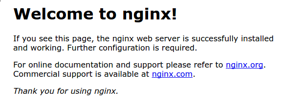
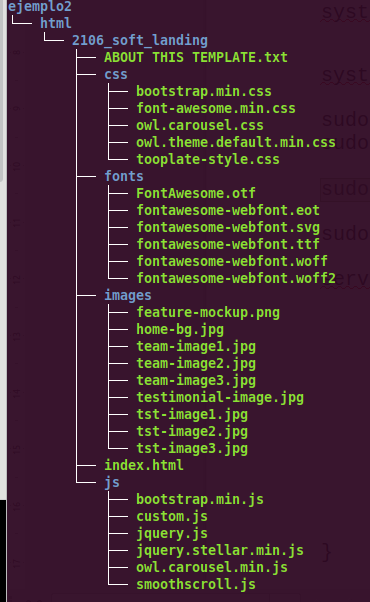

1.[Práctica guiada – Instalación y configuración de servidor web Nginx](#práctica-guiada)
2.[Práctica: Configuración de Autenticación Básica en NGINX](#configuración-autenticación)


# Práctica guiada – Instalación y configuración de servidor web Nginx

## Instalación servidor web Nginx

Para instalar el servidor nginx en nuestra Debian, primero actualizamos los repositorios y después instalamos el paquete correspondiente:
```
sudo apt update

sudo apt install nginx
```

Comprobamos que nginx se ha instalado y que está funcionando correctamente:
```
systemctl status nginx
```


## Creación de las carpeta del sitio web

Igual que ocurre en Apache, todos los archivos que formarán parte de un sitio web que servirá nginx se organizarán en carpetas. Estas carpetas, típicamente están dentro de /var/www.

Así pues, vamos a crear la carpeta de nuestro sitio web o dominio:

```
sudo mkdir -p /var/www/nombre_web/html
```

Donde el nombre de dominio puede ser la palabra que queráis, sin espacios.
Ahí, dentro de esa carpeta html, debéis clonar el siguiente repositorio:

```
https://github.com/cloudacademy/static-website-example
```

Además, haremos que el propietario de esta carpeta y todo lo que haya dentro sea el usuario www-data, típicamente el usuario del servicio web.

```
sudo chown -R www-data:www-data /var/www/nombre_web/html
```
Y le daremos los permisos adecuados para que no nos de un error de acceso no autorizado al entrar en el sitio web:

```
sudo chmod -R 755 /var/www/nombre_web
```

Para comprobar que el servidor está funcionando y sirviendo páginas correctamente, podéis acceder desde vuestro cliente a:

http://IP-maq-virtual

Y os deberá aparecer algo así:



Lo que demuestra que todo es correcto hasta ahora.

## Configuración de servidor web NGINX

En Nginx hay dos rutas importantes. La primera de ellas es sites-available, que contiene los archivos de configuración de los hosts virtuales o bloques disponibles en el servidor. Es decir, cada uno de los sitios webs que alberga el servido. La otra es sites-enabled, que contiene los archivos de configuración de los sitios habilitados, es decir, los que funcionan en ese momento.

Dentro de sites-available hay un archivo de configuración por defecto (default), que es la página que se muestra si accedemos al servidor sin indicar ningún sitio web o cuando el sitio web no es encontrado en el servidor (debido a una mala configuración por ejemplo). Esta es la página que nos ha aparecido en el apartado anterior.

Para que Nginx presente el contenido de nuestra web, es necesario crear un bloque de servidor con las directivas correctas. En vez de modificar el archivo de configuración predeterminado directamente, crearemos uno nuevo en /etc/nginx/sites-available/nombre_web:

sudo nano /etc/nginx/sites-available/vuestro_dominio 
Y el contenido de ese archivo de configuración:

```
server {
        listen 80;
        listen [::]:80;
        root /ruta/absoluta/archivo/index;
        index index.html index.htm index.nginx-debian.html;
        server_name nombre_web;
        location / {
                try_files $uri $uri/ =404;
        }
}
```

Aquí la directiva root debe ir seguida de la ruta absoluta absoluta dónde se encuentre el archivo index.html de nuestra página web, que se encuentra entre todos los que habéis descomprimido.

Aquí tenéis un ejemplo de un sitio webs con su ruta (directorios que hay) antes del archivo index.html:




>Info

>Ruta → /var/www/ejemplo2/html/2016_soft_landing

Y crearemos un archivo simbólico entre este archivo y el de sitios que están habilitados, para que se dé de alta automáticamente.

```
sudo ln -s /etc/nginx/sites-available/nombre_web /etc/nginx/sites-enabled/
```

Y reiniciamos el servidor para aplicar la configuración:
```
sudo systemctl restart nginx
```
## Comprobaciones

Comprobación del correcto funcionamiento
Como aún no poseemos un servidor DNS que traduzca los nombres a IPs, debemos hacerlo de forma manual. Vamos a editar el archivo /etc/hosts de nuestra máquina anfitriona para que asocie la IP de la máquina virtual, a nuestro server_name.

Este archivo, en Linux, está en: /etc/hosts

Y en Windows: `C:\Windows\System32\drivers\etc\hosts`

Y deberemos añadirle la línea:

`192.168.X.X nombre_web`

donde debéis sustituir la IP por la que tenga vuestra máquina virtual.

## Comprobar registros del servidor
Comprobad que las peticiones se están registrando correctamente en los archivos de logs, tanto las correctas como las erróneas:

`/var/log/nginx/access.log`: cada solicitud a su servidor web se registra en este archivo de registro, a menos que Nginx esté configurado para hacer algo diferente.

`/var/log/nginx/error.log`: cualquier error de Nginx se asentará en este registro.

## Info

Si no os aparece nada en los logs, podría pasar que el navegador ha cacheado la página web y que, por tanto, ya no está obteniendo la página del navegador sino de la propia memoria. Para solucionar esto, podéis acceder con el modo privado del navegador y ya os debería registrar esa actividad en los logs.

---


### Práctica: Configuración de Autenticación Básica en NGINX 
**Objetivo:** 
En esta práctica, configurarás la autenticación básica en NGINX para proteger el acceso a un sitio web con un nombre de usuario y una contraseña. Aprenderás a usar archivos `.htpasswd` y configurar las directivas correspondientes en NGINX.

---


#### Requisitos: 

- Tener NGINX instalado y configurado en el servidor.
 
- Tener configurado al menos un sitio virtual en el archivo de configuración NGINX (por ejemplo, en `/etc/nginx/sites-available/`).
 
- Acceso al servidor con privilegios de administrador o `sudo`.


---


### Paso 1: Instalar herramientas necesarias 
Para crear el archivo `.htpasswd` que contendrá los usuarios y contraseñas cifradas, es necesario instalar la herramienta `apache2-utils` (si no está instalada ya):

```bash
sudo apt update
sudo apt install apache2-utils
```

### Paso 2: Crear el archivo de contraseñas 
Usa el comando `htpasswd` para crear un archivo de contraseñas cifradas. En este ejemplo, vamos a crear un usuario llamado `usuario1`.

```bash
sudo htpasswd -c /etc/nginx/.htpasswd usuario1
```
Te pedirá ingresar una contraseña para `usuario1`. Si deseas añadir más usuarios, puedes repetir el comando sin el parámetro `-c`:

```bash
sudo htpasswd /etc/nginx/.htpasswd usuario2
```

### Paso 3: Configurar NGINX 
Ahora, modifica el archivo de configuración del sitio que deseas proteger. Este archivo normalmente se encuentra en `/etc/nginx/sites-available/` o `/etc/nginx/nginx.conf` si es un único sitio. Asegúrate de que la configuración del bloque `server` se vea de la siguiente manera:

```nginx
server {
    listen 80;
    server_name midominio.com;

    location / {
        root /var/www/misitio;
        index index.html;

        # Configurar autenticación básica
        auth_basic "Área Protegida";
        auth_basic_user_file /etc/nginx/.htpasswd;
    }
}
```
 
- `auth_basic "Área Protegida";` define el mensaje que aparecerá en el cuadro de autenticación.
 
- `auth_basic_user_file /etc/nginx/.htpasswd;` apunta al archivo de contraseñas creado anteriormente.

### Paso 4: Verificar la configuración 

Antes de reiniciar NGINX, verifica que la configuración sea correcta usando el siguiente comando:


```bash
sudo nginx -t
```

Si no hay errores, recarga la configuración de NGINX:


```bash
sudo systemctl reload nginx
```

### Paso 5: Probar la autenticación 
Abre un navegador e ingresa la URL de tu sitio (por ejemplo, `http://midominio.com`). Deberías ver un cuadro de diálogo pidiéndote un nombre de usuario y contraseña. Introduce las credenciales que creaste en el archivo `.htpasswd` para acceder al sitio.

---


### Actividades adicionales: 
 
1. **Agregar HTTPS** : Configura NGINX para usar HTTPS y asegúrate de que la autenticación básica esté disponible solo a través de conexiones seguras.
 
2. **Limitar el acceso a una ubicación específica** : Modifica la configuración para que solo una carpeta (por ejemplo, `/admin`) requiera autenticación, dejando el resto del sitio accesible sin ella.
 
3. **Agregar restricciones por IP** : Investiga cómo limitar el acceso a determinadas direcciones IP además de la autenticación básica.


---


Con esta práctica habrás aprendido a proteger sitios web con autenticación básica en NGINX, asegurando que solo usuarios autorizados puedan acceder a los recursos.

---


# Instalar https/43

## Método 1

Para agregar HTTPS a un sitio en NGINX, necesitas obtener un certificado SSL/TLS y configurar tu servidor NGINX para usarlo. A continuación te explico cómo hacerlo paso a paso usando **Let's Encrypt**  para obtener un certificado SSL gratuito, junto con la herramienta `Certbot` para facilitar el proceso.
### Paso 1: Instalar Certbot 

Certbot es una herramienta que automatiza la obtención y renovación de certificados SSL de Let's Encrypt.
 
1. Actualiza los paquetes de tu sistema:


```bash
sudo apt update
```
 
2. Instala Certbot y el plugin de NGINX:


```bash
sudo apt install certbot python3-certbot-nginx
```

### Paso 2: Obtener un certificado SSL con Let's Encrypt 

Ahora, puedes usar Certbot para solicitar un certificado SSL para tu dominio.
 
1. Ejecuta Certbot con el siguiente comando:


```bash
sudo certbot --nginx
```
 
2. Certbot te pedirá algunas opciones, como:

  - El dominio para el cual deseas obtener el certificado (asegúrate de que el dominio esté correctamente configurado en tu archivo de configuración de NGINX).

  - Si deseas redirigir todo el tráfico HTTP a HTTPS (opción recomendada). Selecciona "Sí" si deseas forzar HTTPS en todo el sitio.

Certbot configurará automáticamente NGINX para que utilice HTTPS y también agregará las redirecciones necesarias.

### Paso 3: Verificar la configuración de NGINX 

Después de que Certbot termine, el archivo de configuración de tu sitio en NGINX debería verse similar a este:


```nginx
server {
    listen 80;
    server_name midominio.com www.midominio.com;

    # Redirección de HTTP a HTTPS
    return 301 https://$host$request_uri;
}

server {
    listen 443 ssl;
    server_name midominio.com www.midominio.com;

    root /var/www/misitio;
    index index.html;

    # Configuración de SSL
    ssl_certificate /etc/letsencrypt/live/midominio.com/fullchain.pem;
    ssl_certificate_key /etc/letsencrypt/live/midominio.com/privkey.pem;
    include /etc/letsencrypt/options-ssl-nginx.conf;
    ssl_dhparam /etc/letsencrypt/ssl-dhparams.pem;

    location / {
        try_files $uri $uri/ =404;
    }
}
```

### Explicación de las secciones: 
 
1. **Redirección HTTP a HTTPS:** 
El primer bloque redirige todo el tráfico HTTP (puerto 80) a HTTPS (puerto 443).
 
2. **Configuración HTTPS:** 
El segundo bloque configura el servidor para escuchar en el puerto 443 con SSL habilitado: 
  - `ssl_certificate` y `ssl_certificate_key`: Especifican los archivos del certificado y la clave privada generados por Let's Encrypt.
 
  - `include /etc/letsencrypt/options-ssl-nginx.conf`: Este archivo incluye configuraciones de seguridad recomendadas.
 
  - `ssl_dhparam`: Archivo de parámetros Diffie-Hellman para mayor seguridad.

### Paso 4: Recargar la configuración de NGINX 

Verifica que no haya errores en la configuración con:


```bash
sudo nginx -t
```

Si todo está correcto, recarga la configuración de NGINX:


```bash
sudo systemctl reload nginx
```

### Paso 5: Probar HTTPS 
Abre un navegador y navega a `https://midominio.com`. Si todo está correctamente configurado, deberías ver que el sitio ahora usa HTTPS y tu navegador mostrará un candado indicando que la conexión es segura.
### Paso 6: Renovación automática del certificado 

Los certificados de Let's Encrypt tienen una validez de 90 días, pero Certbot puede configurarse para renovarlos automáticamente. Esto ya debería estar habilitado al instalar Certbot. Para verificar que la renovación automática está configurada, puedes ejecutar un comando de prueba:


```bash
sudo certbot renew --dry-run
```

Este comando simula el proceso de renovación y te informará si hubo algún problema.


---


Con estos pasos, tu sitio estará protegido con HTTPS y redirigirá automáticamente las conexiones HTTP a HTTPS para asegurar que todo el tráfico esté cifrado.

## Método 2


Además de usar **Let's Encrypt**  y Certbot, hay otras formas de agregar SSL a un sitio NGINX. A continuación te explico dos métodos alternativos:1. **Usar un certificado SSL comprado a una autoridad certificadora (CA)** Si prefieres no usar Let's Encrypt o necesitas un certificado más personalizado (como un certificado de validación extendida o de una marca específica), puedes comprar un certificado SSL de una autoridad certificadora (CA) como **DigiCert** , **Comodo** , **GoDaddy** , entre otras. Los pasos generales son los siguientes:
#### Paso 1: Generar una Solicitud de Firma de Certificado (CSR) 
 
1. Genera una clave privada:


```bash
sudo openssl genrsa -out /etc/nginx/ssl/midominio.key 2048
```
 
2. Genera un CSR (Certificate Signing Request):


```bash
sudo openssl req -new -key /etc/nginx/ssl/midominio.key -out /etc/nginx/ssl/midominio.csr
```

Durante este proceso, se te pedirá que ingreses la información del dominio, como el nombre común (dominio), la organización y otros detalles.
 
3. Envía el archivo `.csr` a la autoridad certificadora de tu elección cuando realices la compra del certificado.

#### Paso 2: Recibir e instalar el certificado 

Después de la validación, la CA te enviará varios archivos:
 
- El certificado del dominio (generalmente con la extensión `.crt`).

- El certificado intermedio y raíz, que conecta tu certificado con la CA.
Coloca estos archivos en el servidor, por ejemplo, en `/etc/nginx/ssl/`.
#### Paso 3: Configurar NGINX con el certificado 

Modifica el archivo de configuración de tu sitio en NGINX para usar el certificado:


```nginx
server {
    listen 443 ssl;
    server_name midominio.com www.midominio.com;

    root /var/www/misitio;
    index index.html;

    # Configuración de SSL con el certificado comprado
    ssl_certificate /etc/nginx/ssl/midominio.crt;
    ssl_certificate_key /etc/nginx/ssl/midominio.key;
    ssl_trusted_certificate /etc/nginx/ssl/cadena-certificados.crt;

    location / {
        try_files $uri $uri/ =404;
    }
}

server {
    listen 80;
    server_name midominio.com www.midominio.com;

    # Redirigir HTTP a HTTPS
    return 301 https://$host$request_uri;
}
```
 
- `ssl_certificate`: Apunta al archivo `.crt` del certificado del dominio.
 
- `ssl_certificate_key`: Apunta a la clave privada generada en el Paso 1.
 
- `ssl_trusted_certificate`: Apunta al archivo que contiene los certificados intermedios y raíz que te proporciona la CA.

#### Paso 4: Verificar y recargar NGINX 

Verifica la configuración de NGINX:


```bash
sudo nginx -t
```

Si todo está correcto, recarga la configuración de NGINX:


```bash
sudo systemctl reload nginx
```

## Método 3

2. **Usar un certificado auto-firmado (self-signed)** 

Este método es útil para entornos de desarrollo o pruebas internas. Un certificado auto-firmado no está respaldado por una autoridad certificadora, por lo que los navegadores mostrarán advertencias de seguridad, pero aún proporcionará encriptación SSL.

#### Paso 1: Generar un certificado auto-firmado 
 
1. Genera una clave privada:


```bash
sudo openssl genpkey -algorithm RSA -out /etc/nginx/ssl/selfsigned.key
```
 
2. Genera el certificado auto-firmado (válido por 365 días):


```bash
sudo openssl req -new -x509 -key /etc/nginx/ssl/selfsigned.key -out /etc/nginx/ssl/selfsigned.crt -days 365
```

Durante el proceso, se te pedirá ingresar información para el certificado, incluyendo el nombre común (dominio), organización, etc.

#### Paso 2: Configurar NGINX con el certificado auto-firmado 

Modifica tu configuración de NGINX para utilizar el certificado auto-firmado:


```nginx
server {
    listen 443 ssl;
    server_name midominio.com www.midominio.com;

    root /var/www/misitio;
    index index.html;

    # Configuración de SSL con el certificado auto-firmado
    ssl_certificate /etc/nginx/ssl/selfsigned.crt;
    ssl_certificate_key /etc/nginx/ssl/selfsigned.key;

    location / {
        try_files $uri $uri/ =404;
    }
}

server {
    listen 80;
    server_name midominio.com www.midominio.com;

    # Redirigir HTTP a HTTPS
    return 301 https://$host$request_uri;
}
```

#### Paso 3: Verificar y recargar NGINX 

Verifica que la configuración de NGINX esté correcta:


```bash
sudo nginx -t
```

Recarga NGINX para aplicar los cambios:


```bash
sudo systemctl reload nginx
```

#### Advertencia: 

Cuando visites el sitio con el certificado auto-firmado, verás una advertencia en el navegador indicando que la conexión no es segura. Esto se debe a que el certificado no está validado por una autoridad certificadora. Puedes ignorar la advertencia para propósitos de desarrollo.


---


Ambos métodos son alternativas válidas dependiendo de tu escenario. Si buscas simplicidad y un certificado gratuito para producción, Let's Encrypt es la mejor opción. Si necesitas un certificado personalizado o específico de una CA, entonces el primer método con una autoridad certificadora es el adecuado. Para pruebas locales o desarrollo, un certificado auto-firmado es una solución rápida.
