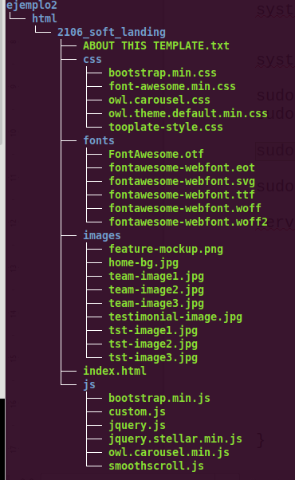

# Práctica guiada – Instalación y configuración de servidor web Nginx


## Instalación servidor web Nginx

Para instalar el servidor nginx en nuestra Debian, primero actualizamos los repositorios y después instalamos el paquete correspondiente:
```
sudo apt update

sudo apt install nginx
```

Comprobamos que nginx se ha instalado y que está funcionando correctamente:
```
systemctl status nginx
```


## Creación de las carpeta del sitio web

Igual que ocurre en Apache, todos los archivos que formarán parte de un sitio web que servirá nginx se organizarán en carpetas. Estas carpetas, típicamente están dentro de /var/www.

Así pues, vamos a crear la carpeta de nuestro sitio web o dominio:

```
sudo mkdir -p /var/www/nombre_web/html
```

Donde el nombre de dominio puede ser la palabra que queráis, sin espacios.
Ahí, dentro de esa carpeta html, debéis clonar el siguiente repositorio:

```
https://github.com/cloudacademy/static-website-example
```

Además, haremos que el propietario de esta carpeta y todo lo que haya dentro sea el usuario www-data, típicamente el usuario del servicio web.

```
sudo chown -R www-data:www-data /var/www/nombre_web/html
```
Y le daremos los permisos adecuados para que no nos de un error de acceso no autorizado al entrar en el sitio web:

```
sudo chmod -R 755 /var/www/nombre_web
```

Para comprobar que el servidor está funcionando y sirviendo páginas correctamente, podéis acceder desde vuestro cliente a:

http://IP-maq-virtual

Y os deberá aparecer algo así:


Lo que demuestra que todo es correcto hasta ahora.

## Configuración de servidor web NGINX

En Nginx hay dos rutas importantes. La primera de ellas es sites-available, que contiene los archivos de configuración de los hosts virtuales o bloques disponibles en el servidor. Es decir, cada uno de los sitios webs que alberga el servido. La otra es sites-enabled, que contiene los archivos de configuración de los sitios habilitados, es decir, los que funcionan en ese momento.

Dentro de sites-available hay un archivo de configuración por defecto (default), que es la página que se muestra si accedemos al servidor sin indicar ningún sitio web o cuando el sitio web no es encontrado en el servidor (debido a una mala configuración por ejemplo). Esta es la página que nos ha aparecido en el apartado anterior.

Para que Nginx presente el contenido de nuestra web, es necesario crear un bloque de servidor con las directivas correctas. En vez de modificar el archivo de configuración predeterminado directamente, crearemos uno nuevo en /etc/nginx/sites-available/nombre_web:

sudo nano /etc/nginx/sites-available/vuestro_dominio 
Y el contenido de ese archivo de configuración:

```
server {
        listen 80;
        listen [::]:80;
        root /ruta/absoluta/archivo/index;
        index index.html index.htm index.nginx-debian.html;
        server_name nombre_web;
        location / {
                try_files $uri $uri/ =404;
        }
}
```

Aquí la directiva root debe ir seguida de la ruta absoluta absoluta dónde se encuentre el archivo index.html de nuestra página web, que se encuentra entre todos los que habéis descomprimido.

Aquí tenéis un ejemplo de un sitio webs con su ruta (directorios que hay) antes del archivo index.html:




>Info

>Ruta → /var/www/ejemplo2/html/2016_soft_landing

Y crearemos un archivo simbólico entre este archivo y el de sitios que están habilitados, para que se dé de alta automáticamente.

```
sudo ln -s /etc/nginx/sites-available/nombre_web /etc/nginx/sites-enabled/
```

Y reiniciamos el servidor para aplicar la configuración:
```
sudo systemctl restart nginx
```
## Comprobaciones

Comprobación del correcto funcionamiento
Como aún no poseemos un servidor DNS que traduzca los nombres a IPs, debemos hacerlo de forma manual. Vamos a editar el archivo /etc/hosts de nuestra máquina anfitriona para que asocie la IP de la máquina virtual, a nuestro server_name.

Este archivo, en Linux, está en: /etc/hosts

Y en Windows: `C:\Windows\System32\drivers\etc\hosts`

Y deberemos añadirle la línea:

`192.168.X.X nombre_web`

donde debéis sustituir la IP por la que tenga vuestra máquina virtual.

## Comprobar registros del servidor
Comprobad que las peticiones se están registrando correctamente en los archivos de logs, tanto las correctas como las erróneas:

`/var/log/nginx/access.log`: cada solicitud a su servidor web se registra en este archivo de registro, a menos que Nginx esté configurado para hacer algo diferente.

`/var/log/nginx/error.log`: cualquier error de Nginx se asentará en este registro.

## Info

Si no os aparece nada en los logs, podría pasar que el navegador ha cacheado la página web y que, por tanto, ya no está obteniendo la página del navegador sino de la propia memoria. Para solucionar esto, podéis acceder con el modo privado del navegador y ya os debería registrar esa actividad en los logs.

